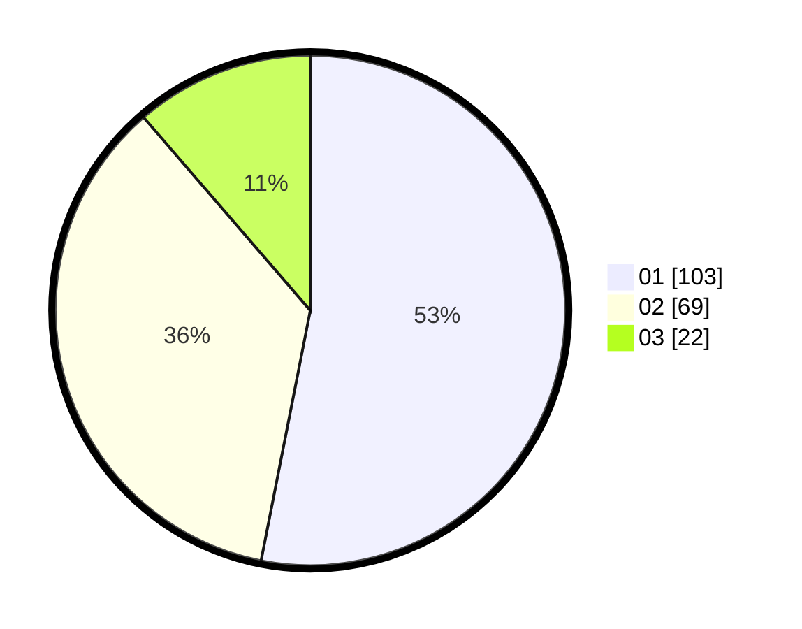

# Hasil

Hasil perolehan suara paslon dapat dilihat pada file paslon-01.txt, paslon-02.txt, dan paslon-03.txt.

Jika tidak ada, artinya data tersebut belum ada pada SIREKAP.

## Perolehan Suara

 * Paslon 01: **103**.
 * Paslon 02: **69**.
 * Paslon 03: **22**.

## Foto C Plano

https://sirekap-obj-formc.kpu.go.id/99d9/pemilu/ppwp/31/71/05/10/02/3171051002074-20240214-225631--3b48c4bc-167a-419a-8afd-0dccb9d39d89.jpg

https://sirekap-obj-formc.kpu.go.id/99d9/pemilu/ppwp/31/71/05/10/02/3171051002074-20240214-225734--b68f4010-639c-4283-8ef5-2efdd4bf2bfa.jpg

https://sirekap-obj-formc.kpu.go.id/99d9/pemilu/ppwp/31/71/05/10/02/3171051002074-20240214-225844--63ff023f-8a89-48bf-bf04-bf84bec6d574.jpg

## DATA PEMILIH TETAP

Jumlah pemilih dalam DPT: **191**.
 * L: **85**.
 * P: **106**.

## DATA PENGGUNA HAK PILIH

Jumlah pengguna hak pilih dalam DPT: **191**.
 * L: **85**.
 * P: **106**.

Jumlah pengguna hak pilih dalam DPTb: **0**.
 * L: **0**.
 * P: **0**.

Jumlah pengguna hak pilih dalam DPK: **5**.
 * L: **3**.
 * P: **2**.

Jumlah pengguna hak pilih: **196**.
 * L: **88**.
 * P: **108**.

## JUMLAH SUARA SAH DAN TIDAK SAH

JUMLAH SELURUH SUARA SAH: **194**.

JUMLAH SUARA TIDAK SAH: **2**.

JUMLAH SELURUH SUARA SAH DAN SUARA TIDAK SAH: **196**.
