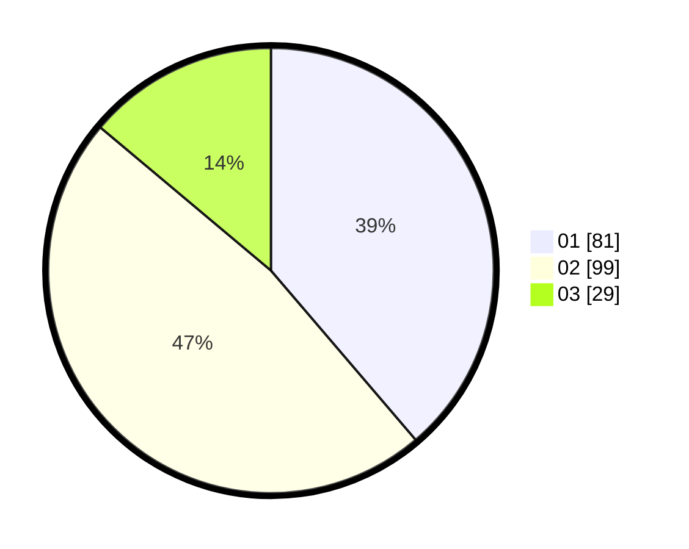

# Hasil

Hasil perolehan suara paslon dapat dilihat pada file paslon-01.txt, paslon-02.txt, dan paslon-03.txt.

Jika tidak ada, artinya data tersebut belum ada pada SIREKAP.

## Perolehan Suara

 * Paslon 01: **81**.
 * Paslon 02: **99**.
 * Paslon 03: **29**.

## Foto C Plano

https://sirekap-obj-formc.kpu.go.id/72b6/pemilu/ppwp/31/71/05/10/02/3171051002077-20240216-092028--e4834156-c8e1-47a1-a6f5-7b532689b62c.jpg

https://sirekap-obj-formc.kpu.go.id/72b6/pemilu/ppwp/31/71/05/10/02/3171051002077-20240216-122911--3e7c31ca-ea80-4156-aa01-50e7d5f1d01e.jpg

https://sirekap-obj-formc.kpu.go.id/72b6/pemilu/ppwp/31/71/05/10/02/3171051002077-20240216-100327--5725b14a-19f5-4a7d-b937-84f628cebed3.jpg

## DATA PEMILIH TETAP

Jumlah pemilih dalam DPT: **263**.
 * L: **125**.
 * P: **138**.

## DATA PENGGUNA HAK PILIH

Jumlah pengguna hak pilih dalam DPT: **207**.
 * L: **95**.
 * P: **112**.

Jumlah pengguna hak pilih dalam DPTb: **5**.
 * L: **4**.
 * P: **1**.

Jumlah pengguna hak pilih dalam DPK: **1**.
 * L: **0**.
 * P: **1**.

Jumlah pengguna hak pilih: **213**.
 * L: **99**.
 * P: **114**.

## JUMLAH SUARA SAH DAN TIDAK SAH

JUMLAH SELURUH SUARA SAH: **209**.

JUMLAH SUARA TIDAK SAH: **4**.

JUMLAH SELURUH SUARA SAH DAN SUARA TIDAK SAH: **213**.
