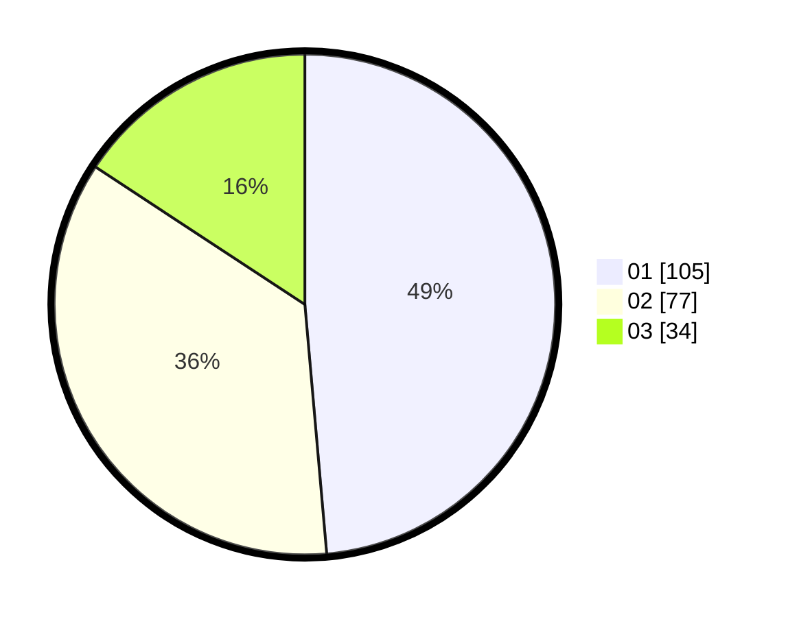

# Hasil

Hasil perolehan suara paslon dapat dilihat pada file paslon-01.txt, paslon-02.txt, dan paslon-03.txt.

Jika tidak ada, artinya data tersebut belum ada pada SIREKAP.

## Perolehan Suara

 * Paslon 01: **105**.
 * Paslon 02: **77**.
 * Paslon 03: **34**.

## Foto C Plano

https://sirekap-obj-formc.kpu.go.id/07e8/pemilu/ppwp/31/71/05/10/02/3171051002092-20240215-020633--304588ac-0891-4d59-8529-229bd5212127.jpg

https://sirekap-obj-formc.kpu.go.id/07e8/pemilu/ppwp/31/71/05/10/02/3171051002092-20240215-020655--43256a6c-a67a-4a60-9b1e-6b2899a94c8c.jpg

https://sirekap-obj-formc.kpu.go.id/07e8/pemilu/ppwp/31/71/05/10/02/3171051002092-20240215-020644--6a8bbf7e-b075-49e2-96ed-5fdc8a4763e8.jpg

## DATA PEMILIH TETAP

Jumlah pemilih dalam DPT: **279**.
 * L: **138**.
 * P: **141**.

## DATA PENGGUNA HAK PILIH

Jumlah pengguna hak pilih dalam DPT: **209**.
 * L: **102**.
 * P: **107**.

Jumlah pengguna hak pilih dalam DPTb: **12**.
 * L: **3**.
 * P: **9**.

Jumlah pengguna hak pilih dalam DPK: **0**.
 * L: **0**.
 * P: **0**.

Jumlah pengguna hak pilih: **221**.
 * L: **105**.
 * P: **116**.

## JUMLAH SUARA SAH DAN TIDAK SAH

JUMLAH SELURUH SUARA SAH: **216**.

JUMLAH SUARA TIDAK SAH: **5**.

JUMLAH SELURUH SUARA SAH DAN SUARA TIDAK SAH: **221**.
