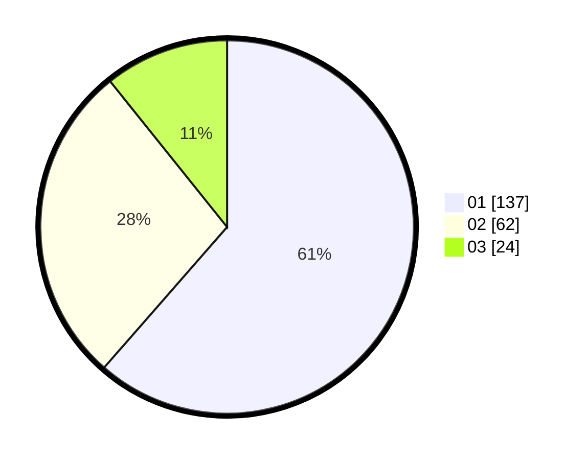

# Hasil

Hasil perolehan suara paslon dapat dilihat pada file paslon-01.txt, paslon-02.txt, dan paslon-03.txt.

Jika tidak ada, artinya data tersebut belum ada pada SIREKAP.

## Perolehan Suara

 * Paslon 01: **137**.
 * Paslon 02: **62**.
 * Paslon 03: **24**.

## Foto C Plano

https://sirekap-obj-formc.kpu.go.id/5576/pemilu/ppwp/31/71/05/10/02/3171051002093-20240214-195515--2df8595b-c535-461d-8cfc-4b8fca49fed0.jpg

https://sirekap-obj-formc.kpu.go.id/5576/pemilu/ppwp/31/71/05/10/02/3171051002093-20240214-195257--6cc263df-4e79-4368-9ead-e15f544e2781.jpg

https://sirekap-obj-formc.kpu.go.id/5576/pemilu/ppwp/31/71/05/10/02/3171051002093-20240214-224749--a269e821-f9df-4347-b994-373022954e8d.jpg

## DATA PEMILIH TETAP

Jumlah pemilih dalam DPT: **281**.
 * L: **137**.
 * P: **144**.

## DATA PENGGUNA HAK PILIH

Jumlah pengguna hak pilih dalam DPT: **220**.
 * L: **106**.
 * P: **114**.

Jumlah pengguna hak pilih dalam DPTb: **4**.
 * L: **2**.
 * P: **2**.

Jumlah pengguna hak pilih dalam DPK: **3**.
 * L: **0**.
 * P: **3**.

Jumlah pengguna hak pilih: **227**.
 * L: **108**.
 * P: **119**.

## JUMLAH SUARA SAH DAN TIDAK SAH

JUMLAH SELURUH SUARA SAH: **223**.

JUMLAH SUARA TIDAK SAH: **4**.

JUMLAH SELURUH SUARA SAH DAN SUARA TIDAK SAH: **227**.
