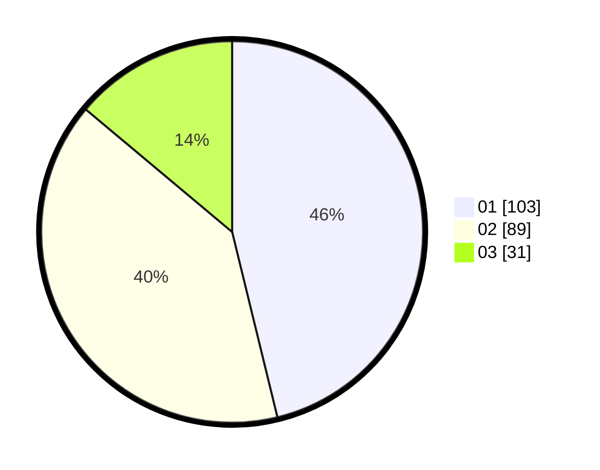

# Hasil

Hasil perolehan suara paslon dapat dilihat pada file paslon-01.txt, paslon-02.txt, dan paslon-03.txt.

Jika tidak ada, artinya data tersebut belum ada pada SIREKAP.

## Perolehan Suara

 * Paslon 01: **103**.
 * Paslon 02: **89**.
 * Paslon 03: **31**.

## Foto C Plano

https://sirekap-obj-formc.kpu.go.id/5689/pemilu/ppwp/31/71/05/10/02/3171051002094-20240216-081623--79632c77-0a59-4413-b6df-391ca7e1e1a7.jpg

https://sirekap-obj-formc.kpu.go.id/5689/pemilu/ppwp/31/71/05/10/02/3171051002094-20240216-073647--2a402d63-3900-4968-be9f-02b888e3ff5d.jpg

https://sirekap-obj-formc.kpu.go.id/5689/pemilu/ppwp/31/71/05/10/02/3171051002094-20240216-081624--82465c75-569c-4d8e-8013-da2d43d00167.jpg

## DATA PEMILIH TETAP

Jumlah pemilih dalam DPT: **280**.
 * L: **139**.
 * P: **141**.

## DATA PENGGUNA HAK PILIH

Jumlah pengguna hak pilih dalam DPT: **225**.
 * L: **106**.
 * P: **119**.

Jumlah pengguna hak pilih dalam DPTb: **2**.
 * L: **2**.
 * P: **0**.

Jumlah pengguna hak pilih dalam DPK: **0**.
 * L: **0**.
 * P: **0**.

Jumlah pengguna hak pilih: **0**.
 * L: **0**.
 * P: **0**.

## JUMLAH SUARA SAH DAN TIDAK SAH

JUMLAH SELURUH SUARA SAH: **223**.

JUMLAH SUARA TIDAK SAH: **4**.

JUMLAH SELURUH SUARA SAH DAN SUARA TIDAK SAH: **227**.
