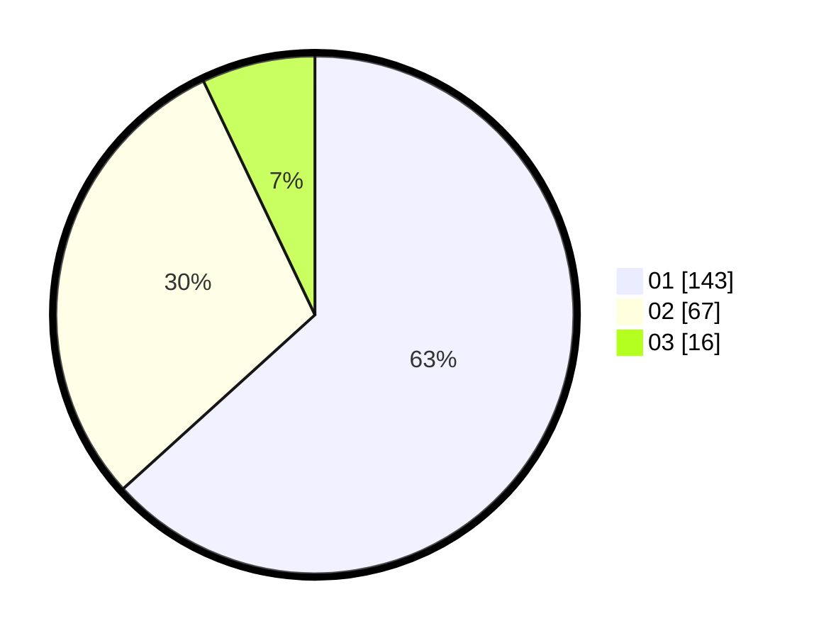

# Hasil

Hasil perolehan suara paslon dapat dilihat pada file paslon-01.txt, paslon-02.txt, dan paslon-03.txt.

Jika tidak ada, artinya data tersebut belum ada pada SIREKAP.

## Perolehan Suara

 * Paslon 01: **143**.
 * Paslon 02: **67**.
 * Paslon 03: **16**.

## Foto C Plano

https://sirekap-obj-formc.kpu.go.id/1d05/pemilu/ppwp/31/71/05/10/02/3171051002095-20240215-015601--6f8081a9-86fb-4ffb-8147-b6dd2f07c61f.jpg

https://sirekap-obj-formc.kpu.go.id/1d05/pemilu/ppwp/31/71/05/10/02/3171051002095-20240215-055922--14ab5845-873b-4a79-9629-16f83687c526.jpg

https://sirekap-obj-formc.kpu.go.id/1d05/pemilu/ppwp/31/71/05/10/02/3171051002095-20240215-015221--6ea7b3b6-5fb2-45a0-861a-2a5e54f0a8a4.jpg

## DATA PEMILIH TETAP

Jumlah pemilih dalam DPT: **278**.
 * L: **141**.
 * P: **137**.

## DATA PENGGUNA HAK PILIH

Jumlah pengguna hak pilih dalam DPT: **226**.
 * L: **114**.
 * P: **112**.

Jumlah pengguna hak pilih dalam DPTb: **5**.
 * L: **2**.
 * P: **3**.

Jumlah pengguna hak pilih dalam DPK: **1**.
 * L: **1**.
 * P: **0**.

Jumlah pengguna hak pilih: **232**.
 * L: **117**.
 * P: **115**.

## JUMLAH SUARA SAH DAN TIDAK SAH

JUMLAH SELURUH SUARA SAH: **0**.

JUMLAH SUARA TIDAK SAH: **0**.

JUMLAH SELURUH SUARA SAH DAN SUARA TIDAK SAH: **0**.
