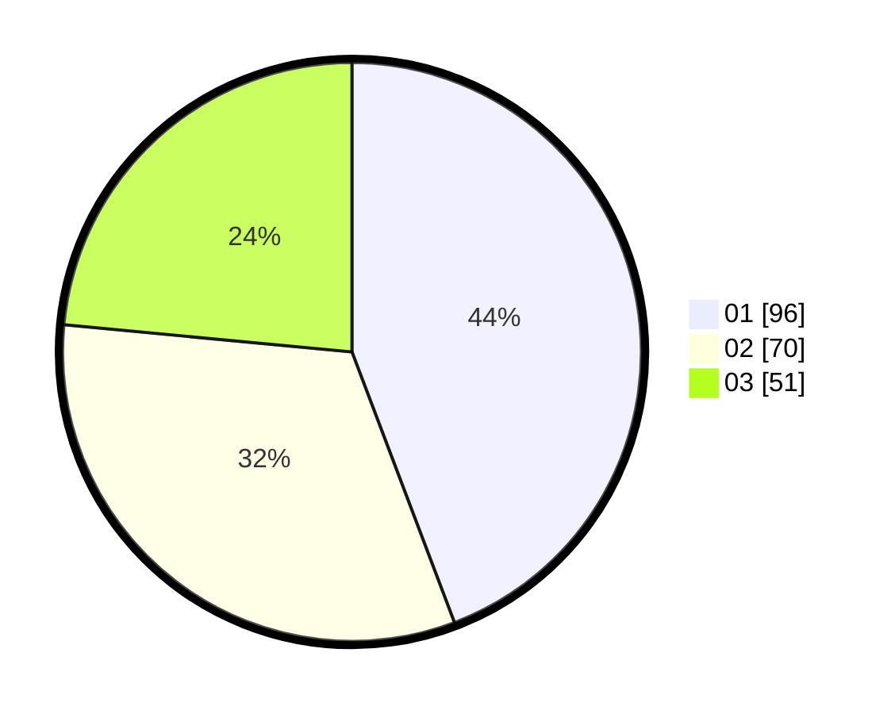

# Hasil

Hasil perolehan suara paslon dapat dilihat pada file paslon-01.txt, paslon-02.txt, dan paslon-03.txt.

Jika tidak ada, artinya data tersebut belum ada pada SIREKAP.

## Perolehan Suara

 * Paslon 01: **96**.
 * Paslon 02: **70**.
 * Paslon 03: **51**.

## Foto C Plano

https://sirekap-obj-formc.kpu.go.id/4e00/pemilu/ppwp/31/71/05/10/02/3171051002097-20240219-145213--f430055c-6215-43c8-9f04-17ccf5b0702a.jpg

https://sirekap-obj-formc.kpu.go.id/4e00/pemilu/ppwp/31/71/05/10/02/3171051002097-20240219-150454--5e1e19d7-c7b4-48e0-a521-cbf48d1988b0.jpg

https://sirekap-obj-formc.kpu.go.id/4e00/pemilu/ppwp/31/71/05/10/02/3171051002097-20240219-150832--818162b8-e4e3-46e2-9872-f9be1f25358c.jpg

## DATA PEMILIH TETAP

Jumlah pemilih dalam DPT: **281**.
 * L: **140**.
 * P: **141**.

## DATA PENGGUNA HAK PILIH

Jumlah pengguna hak pilih dalam DPT: **211**.
 * L: **99**.
 * P: **112**.

Jumlah pengguna hak pilih dalam DPTb: **1**.
 * L: **1**.
 * P: **0**.

Jumlah pengguna hak pilih dalam DPK: **5**.
 * L: **2**.
 * P: **3**.

Jumlah pengguna hak pilih: **217**.
 * L: **102**.
 * P: **115**.

## JUMLAH SUARA SAH DAN TIDAK SAH

JUMLAH SELURUH SUARA SAH: **217**.

JUMLAH SUARA TIDAK SAH: **2**.

JUMLAH SELURUH SUARA SAH DAN SUARA TIDAK SAH: **219**.
