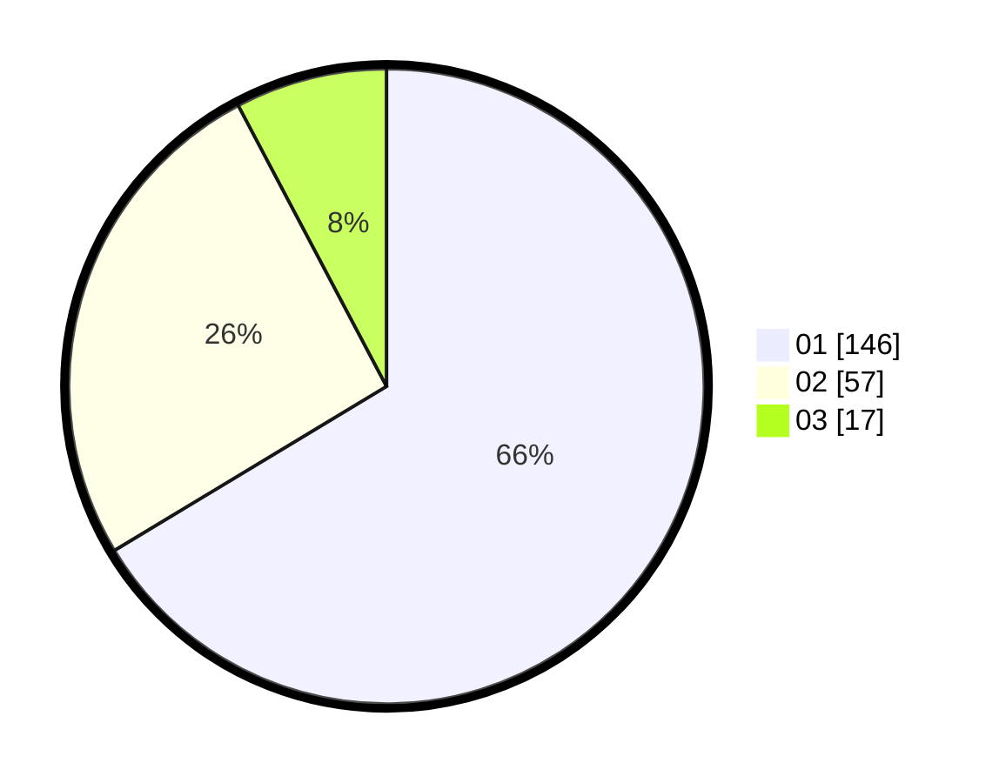

# Hasil

Hasil perolehan suara paslon dapat dilihat pada file paslon-01.txt, paslon-02.txt, dan paslon-03.txt.

Jika tidak ada, artinya data tersebut belum ada pada SIREKAP.

## Perolehan Suara

 * Paslon 01: **146**.
 * Paslon 02: **57**.
 * Paslon 03: **17**.

## Foto C Plano

https://sirekap-obj-formc.kpu.go.id/380f/pemilu/ppwp/31/71/05/10/02/3171051002101-20240215-045217--8bcc6522-f0b4-4ec7-a19e-411693fb8a44.jpg

https://sirekap-obj-formc.kpu.go.id/380f/pemilu/ppwp/31/71/05/10/02/3171051002101-20240215-045403--6ee139df-2624-41b8-8251-4a5bbadc0632.jpg

https://sirekap-obj-formc.kpu.go.id/380f/pemilu/ppwp/31/71/05/10/02/3171051002101-20240215-045452--9d84f1c8-ebe3-44d6-90c3-c06a9f359e29.jpg

## DATA PEMILIH TETAP

Jumlah pemilih dalam DPT: **270**.
 * L: **135**.
 * P: **135**.

## DATA PENGGUNA HAK PILIH

Jumlah pengguna hak pilih dalam DPT: **214**.
 * L: **101**.
 * P: **113**.

Jumlah pengguna hak pilih dalam DPTb: **2**.
 * L: **2**.
 * P: **0**.

Jumlah pengguna hak pilih dalam DPK: **6**.
 * L: **4**.
 * P: **2**.

Jumlah pengguna hak pilih: **222**.
 * L: **107**.
 * P: **115**.

## JUMLAH SUARA SAH DAN TIDAK SAH

JUMLAH SELURUH SUARA SAH: **220**.

JUMLAH SUARA TIDAK SAH: **2**.

JUMLAH SELURUH SUARA SAH DAN SUARA TIDAK SAH: **222**.
