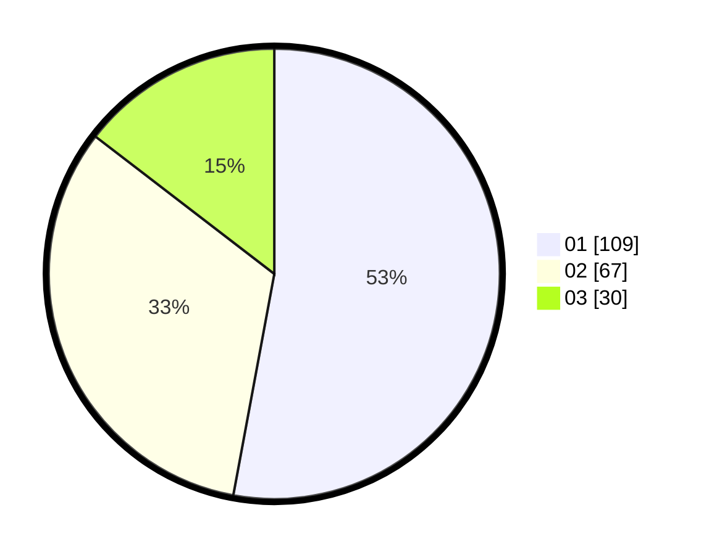

# Hasil

Hasil perolehan suara paslon dapat dilihat pada file paslon-01.txt, paslon-02.txt, dan paslon-03.txt.

Jika tidak ada, artinya data tersebut belum ada pada SIREKAP.

## Perolehan Suara

 * Paslon 01: **109**.
 * Paslon 02: **67**.
 * Paslon 03: **30**.

## Foto C Plano

https://sirekap-obj-formc.kpu.go.id/060a/pemilu/ppwp/31/71/05/10/02/3171051002103-20240216-000618--d3761d12-d238-46f5-bcf2-02c113892ea0.jpg

https://sirekap-obj-formc.kpu.go.id/060a/pemilu/ppwp/31/71/05/10/02/3171051002103-20240216-000620--64a8661e-216d-464d-8394-5ebb73189101.jpg

https://sirekap-obj-formc.kpu.go.id/060a/pemilu/ppwp/31/71/05/10/02/3171051002103-20240216-000619--1ca35942-b64d-4ca8-896c-070729882862.jpg

## DATA PEMILIH TETAP

Jumlah pemilih dalam DPT: **269**.
 * L: **124**.
 * P: **145**.

## DATA PENGGUNA HAK PILIH

Jumlah pengguna hak pilih dalam DPT: **202**.
 * L: **90**.
 * P: **112**.

Jumlah pengguna hak pilih dalam DPTb: **0**.
 * L: **0**.
 * P: **0**.

Jumlah pengguna hak pilih dalam DPK: **5**.
 * L: **2**.
 * P: **3**.

Jumlah pengguna hak pilih: **207**.
 * L: **92**.
 * P: **115**.

## JUMLAH SUARA SAH DAN TIDAK SAH

JUMLAH SELURUH SUARA SAH: **206**.

JUMLAH SUARA TIDAK SAH: **1**.

JUMLAH SELURUH SUARA SAH DAN SUARA TIDAK SAH: **207**.
