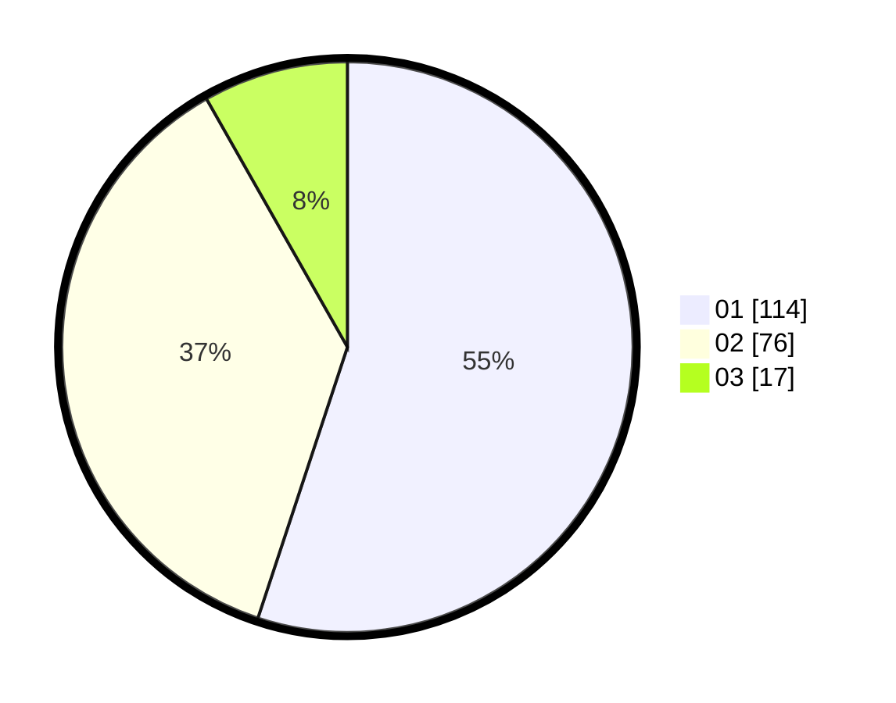

# Hasil

Hasil perolehan suara paslon dapat dilihat pada file paslon-01.txt, paslon-02.txt, dan paslon-03.txt.

Jika tidak ada, artinya data tersebut belum ada pada SIREKAP.

## Perolehan Suara

 * Paslon 01: **114**.
 * Paslon 02: **76**.
 * Paslon 03: **17**.

## Foto C Plano

https://sirekap-obj-formc.kpu.go.id/a8b2/pemilu/ppwp/31/71/05/10/02/3171051002105-20240216-134636--71a4ff7c-06cc-4427-9d59-42e13ab1382e.jpg

https://sirekap-obj-formc.kpu.go.id/a8b2/pemilu/ppwp/31/71/05/10/02/3171051002105-20240216-134637--43a0b4bc-b653-4e69-984c-d51cbe10a5c4.jpg

https://sirekap-obj-formc.kpu.go.id/a8b2/pemilu/ppwp/31/71/05/10/02/3171051002105-20240216-134636--3d6c0e83-3b8d-46d0-aece-c003e459587b.jpg

## DATA PEMILIH TETAP

Jumlah pemilih dalam DPT: **267**.
 * L: **135**.
 * P: **132**.

## DATA PENGGUNA HAK PILIH

Jumlah pengguna hak pilih dalam DPT: **207**.
 * L: **108**.
 * P: **99**.

Jumlah pengguna hak pilih dalam DPTb: **1**.
 * L: **0**.
 * P: **1**.

Jumlah pengguna hak pilih dalam DPK: **0**.
 * L: **0**.
 * P: **0**.

Jumlah pengguna hak pilih: **208**.
 * L: **108**.
 * P: **100**.

## JUMLAH SUARA SAH DAN TIDAK SAH

JUMLAH SELURUH SUARA SAH: **207**.

JUMLAH SUARA TIDAK SAH: **1**.

JUMLAH SELURUH SUARA SAH DAN SUARA TIDAK SAH: **208**.
