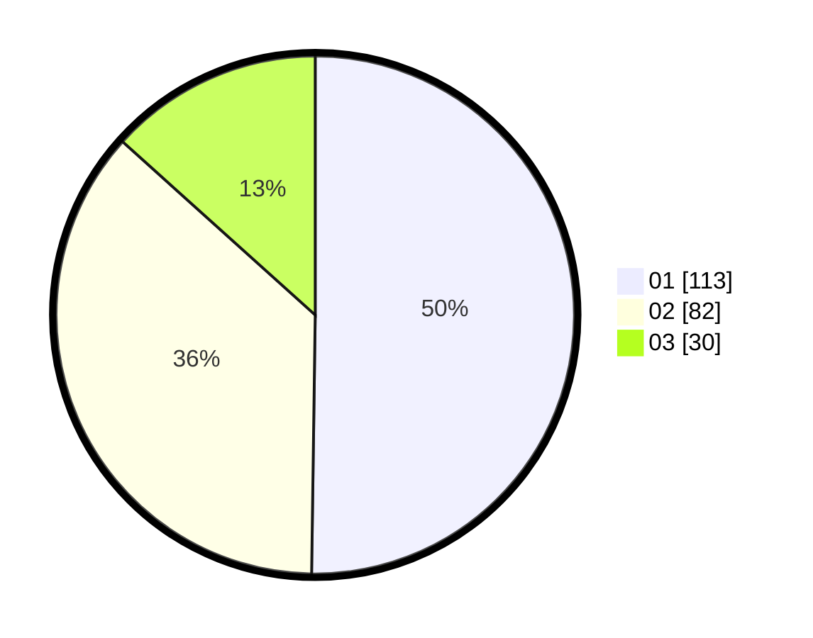

# Hasil

Hasil perolehan suara paslon dapat dilihat pada file paslon-01.txt, paslon-02.txt, dan paslon-03.txt.

Jika tidak ada, artinya data tersebut belum ada pada SIREKAP.

## Perolehan Suara

 * Paslon 01: **113**.
 * Paslon 02: **82**.
 * Paslon 03: **30**.

## Foto C Plano

https://sirekap-obj-formc.kpu.go.id/f93d/pemilu/ppwp/31/71/05/10/02/3171051002106-20240214-194649--07b85eb1-7c4a-4679-81b2-7dcf9a10d24c.jpg

https://sirekap-obj-formc.kpu.go.id/f93d/pemilu/ppwp/31/71/05/10/02/3171051002106-20240214-194829--06d7d54f-67dc-48a7-a702-b6ec18e28132.jpg

https://sirekap-obj-formc.kpu.go.id/f93d/pemilu/ppwp/31/71/05/10/02/3171051002106-20240214-194937--7a528ec5-8587-4d43-a97b-027e62930d47.jpg

## DATA PEMILIH TETAP

Jumlah pemilih dalam DPT: **280**.
 * L: **149**.
 * P: **131**.

## DATA PENGGUNA HAK PILIH

Jumlah pengguna hak pilih dalam DPT: **221**.
 * L: **111**.
 * P: **110**.

Jumlah pengguna hak pilih dalam DPTb: **2**.
 * L: **1**.
 * P: **1**.

Jumlah pengguna hak pilih dalam DPK: **4**.
 * L: **3**.
 * P: **1**.

Jumlah pengguna hak pilih: **227**.
 * L: **115**.
 * P: **112**.

## JUMLAH SUARA SAH DAN TIDAK SAH

JUMLAH SELURUH SUARA SAH: **225**.

JUMLAH SUARA TIDAK SAH: **2**.

JUMLAH SELURUH SUARA SAH DAN SUARA TIDAK SAH: **227**.
