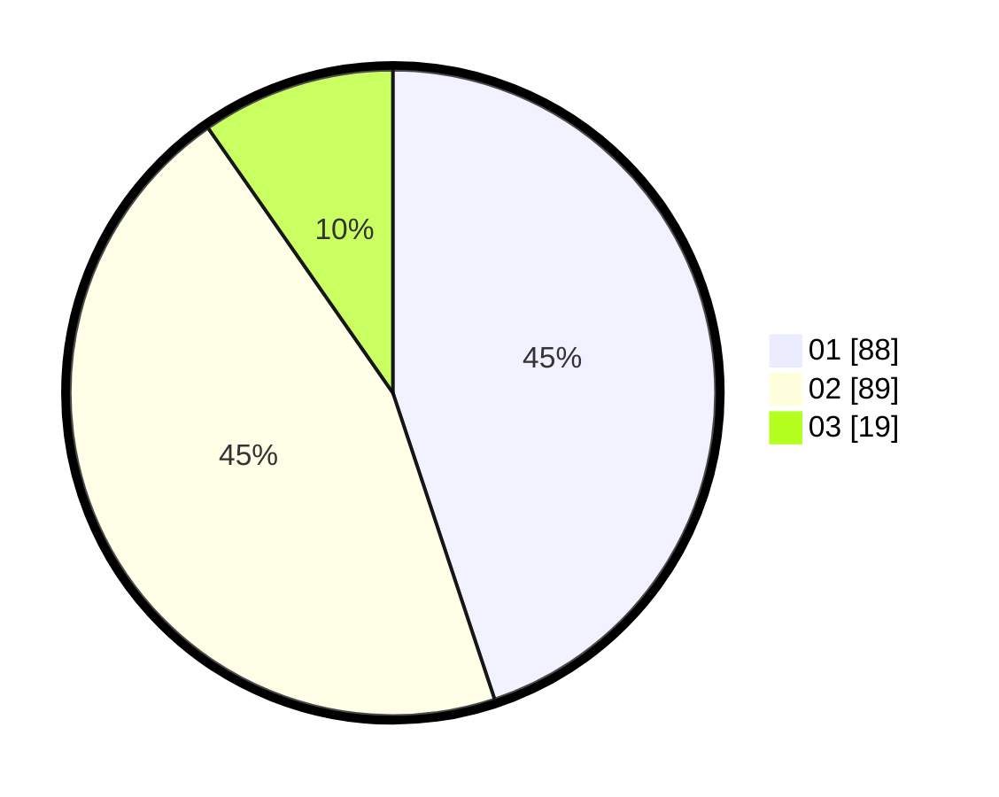

# Hasil

Hasil perolehan suara paslon dapat dilihat pada file paslon-01.txt, paslon-02.txt, dan paslon-03.txt.

Jika tidak ada, artinya data tersebut belum ada pada SIREKAP.

## Perolehan Suara

 * Paslon 01: **88**.
 * Paslon 02: **89**.
 * Paslon 03: **19**.

## Foto C Plano

https://sirekap-obj-formc.kpu.go.id/73ee/pemilu/ppwp/31/71/05/10/02/3171051002107-20240216-135455--7537acb2-3ad8-4613-afb4-b3a2ec4ab8f1.jpg

https://sirekap-obj-formc.kpu.go.id/73ee/pemilu/ppwp/31/71/05/10/02/3171051002107-20240216-135456--066dacb9-9281-4e74-a577-ab560c085653.jpg

https://sirekap-obj-formc.kpu.go.id/73ee/pemilu/ppwp/31/71/05/10/02/3171051002107-20240216-135455--63939c95-5dd1-4ebd-8d85-6184a774f4bf.jpg

## DATA PEMILIH TETAP

Jumlah pemilih dalam DPT: **276**.
 * L: **134**.
 * P: **142**.

## DATA PENGGUNA HAK PILIH

Jumlah pengguna hak pilih dalam DPT: **196**.
 * L: **98**.
 * P: **98**.

Jumlah pengguna hak pilih dalam DPTb: **1**.
 * L: **1**.
 * P: **0**.

Jumlah pengguna hak pilih dalam DPK: **0**.
 * L: **0**.
 * P: **0**.

Jumlah pengguna hak pilih: **197**.
 * L: **99**.
 * P: **98**.

## JUMLAH SUARA SAH DAN TIDAK SAH

JUMLAH SELURUH SUARA SAH: **196**.

JUMLAH SUARA TIDAK SAH: **1**.

JUMLAH SELURUH SUARA SAH DAN SUARA TIDAK SAH: **197**.
