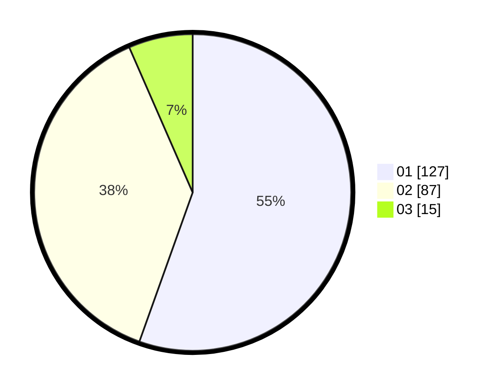

# Hasil

Hasil perolehan suara paslon dapat dilihat pada file paslon-01.txt, paslon-02.txt, dan paslon-03.txt.

Jika tidak ada, artinya data tersebut belum ada pada SIREKAP.

## Perolehan Suara

 * Paslon 01: **127**.
 * Paslon 02: **87**.
 * Paslon 03: **15**.

## Foto C Plano

https://sirekap-obj-formc.kpu.go.id/a775/pemilu/ppwp/31/71/05/10/02/3171051002108-20240215-024425--3f52282b-0477-4c2d-825a-66cf6244760d.jpg

https://sirekap-obj-formc.kpu.go.id/a775/pemilu/ppwp/31/71/05/10/02/3171051002108-20240215-024554--e9433fe1-9352-4d18-a2bf-0aa9763a68d0.jpg

https://sirekap-obj-formc.kpu.go.id/a775/pemilu/ppwp/31/71/05/10/02/3171051002108-20240215-024718--28b303a6-b572-4141-9068-26a4f277b92b.jpg

## DATA PEMILIH TETAP

Jumlah pemilih dalam DPT: **292**.
 * L: **150**.
 * P: **142**.

## DATA PENGGUNA HAK PILIH

Jumlah pengguna hak pilih dalam DPT: **229**.
 * L: **126**.
 * P: **103**.

Jumlah pengguna hak pilih dalam DPTb: **1**.
 * L: **1**.
 * P: **0**.

Jumlah pengguna hak pilih dalam DPK: **1**.
 * L: **0**.
 * P: **1**.

Jumlah pengguna hak pilih: **231**.
 * L: **127**.
 * P: **104**.

## JUMLAH SUARA SAH DAN TIDAK SAH

JUMLAH SELURUH SUARA SAH: **229**.

JUMLAH SUARA TIDAK SAH: **2**.

JUMLAH SELURUH SUARA SAH DAN SUARA TIDAK SAH: **231**.
