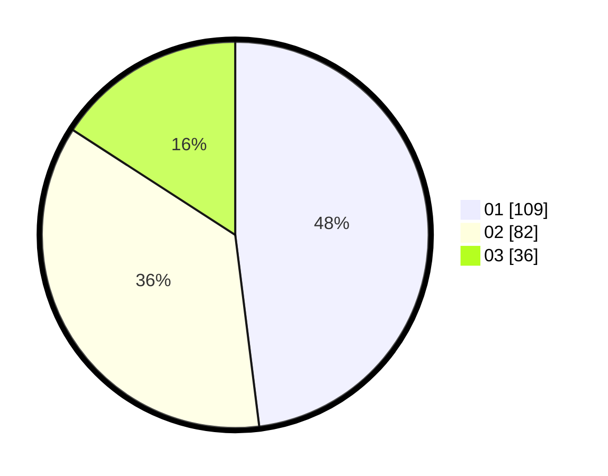

# Hasil

Hasil perolehan suara paslon dapat dilihat pada file paslon-01.txt, paslon-02.txt, dan paslon-03.txt.

Jika tidak ada, artinya data tersebut belum ada pada SIREKAP.

## Perolehan Suara

 * Paslon 01: **109**.
 * Paslon 02: **82**.
 * Paslon 03: **36**.

## Foto C Plano

https://sirekap-obj-formc.kpu.go.id/0820/pemilu/ppwp/31/71/05/10/02/3171051002109-20240214-195931--d8633d49-572f-4802-af98-bb0fb9d53e54.jpg

https://sirekap-obj-formc.kpu.go.id/0820/pemilu/ppwp/31/71/05/10/02/3171051002109-20240214-155242--513ab542-3e88-422a-9441-28eb715e26f9.jpg

https://sirekap-obj-formc.kpu.go.id/0820/pemilu/ppwp/31/71/05/10/02/3171051002109-20240214-155341--982d1f5b-83b9-4374-a816-9d8a1c8b509d.jpg

## DATA PEMILIH TETAP

Jumlah pemilih dalam DPT: **294**.
 * L: **132**.
 * P: **162**.

## DATA PENGGUNA HAK PILIH

Jumlah pengguna hak pilih dalam DPT: **228**.
 * L: **98**.
 * P: **130**.

Jumlah pengguna hak pilih dalam DPTb: **1**.
 * L: **0**.
 * P: **1**.

Jumlah pengguna hak pilih dalam DPK: **1**.
 * L: **0**.
 * P: **1**.

Jumlah pengguna hak pilih: **230**.
 * L: **98**.
 * P: **132**.

## JUMLAH SUARA SAH DAN TIDAK SAH

JUMLAH SELURUH SUARA SAH: **227**.

JUMLAH SUARA TIDAK SAH: **3**.

JUMLAH SELURUH SUARA SAH DAN SUARA TIDAK SAH: **230**.
