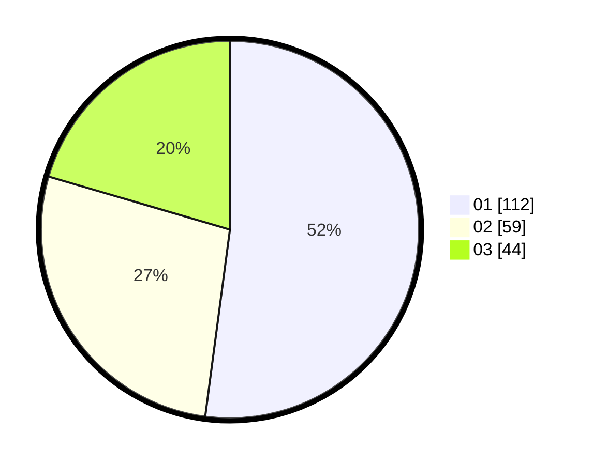

# Hasil

Hasil perolehan suara paslon dapat dilihat pada file paslon-01.txt, paslon-02.txt, dan paslon-03.txt.

Jika tidak ada, artinya data tersebut belum ada pada SIREKAP.

## Perolehan Suara

 * Paslon 01: **112**.
 * Paslon 02: **59**.
 * Paslon 03: **44**.

## Foto C Plano

https://sirekap-obj-formc.kpu.go.id/04b0/pemilu/ppwp/31/71/05/10/02/3171051002110-20240215-222805--4763c727-0600-41e7-827d-a83691b334b3.jpg

https://sirekap-obj-formc.kpu.go.id/04b0/pemilu/ppwp/31/71/05/10/02/3171051002110-20240215-222808--37d9b071-06e9-45bc-ab1f-32b6b4a83212.jpg

https://sirekap-obj-formc.kpu.go.id/04b0/pemilu/ppwp/31/71/05/10/02/3171051002110-20240215-222806--f963eed6-2f67-4d19-b992-2e0ac8d12f0e.jpg

## DATA PEMILIH TETAP

Jumlah pemilih dalam DPT: **291**.
 * L: **133**.
 * P: **158**.

## DATA PENGGUNA HAK PILIH

Jumlah pengguna hak pilih dalam DPT: **216**.
 * L: **91**.
 * P: **125**.

Jumlah pengguna hak pilih dalam DPTb: **4**.
 * L: **2**.
 * P: **2**.

Jumlah pengguna hak pilih dalam DPK: **0**.
 * L: **0**.
 * P: **0**.

Jumlah pengguna hak pilih: **220**.
 * L: **93**.
 * P: **127**.

## JUMLAH SUARA SAH DAN TIDAK SAH

JUMLAH SELURUH SUARA SAH: **215**.

JUMLAH SUARA TIDAK SAH: **5**.

JUMLAH SELURUH SUARA SAH DAN SUARA TIDAK SAH: **220**.
