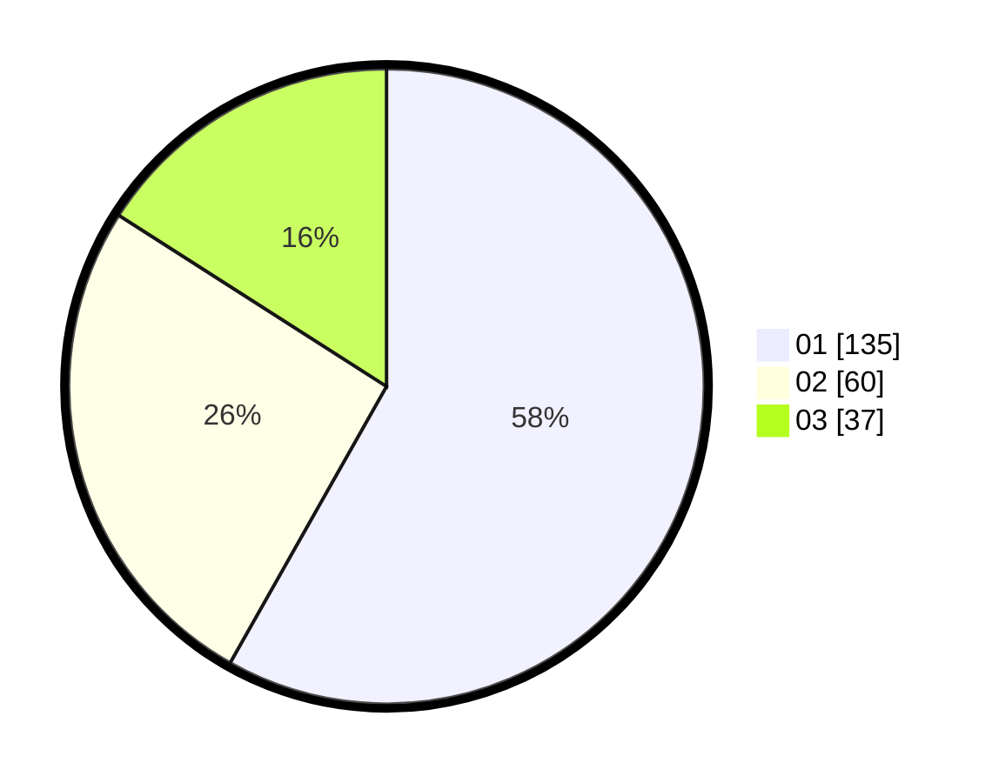

# Hasil

Hasil perolehan suara paslon dapat dilihat pada file paslon-01.txt, paslon-02.txt, dan paslon-03.txt.

Jika tidak ada, artinya data tersebut belum ada pada SIREKAP.

## Perolehan Suara

 * Paslon 01: **135**.
 * Paslon 02: **60**.
 * Paslon 03: **37**.

## Foto C Plano

https://sirekap-obj-formc.kpu.go.id/8d98/pemilu/ppwp/31/71/05/10/02/3171051002118-20240216-131513--fec5046a-b8a8-404c-83d9-42246de04721.jpg

https://sirekap-obj-formc.kpu.go.id/8d98/pemilu/ppwp/31/71/05/10/02/3171051002118-20240216-131515--8c98c88a-f0a7-487b-9f2a-fbb2c2f1e566.jpg

https://sirekap-obj-formc.kpu.go.id/8d98/pemilu/ppwp/31/71/05/10/02/3171051002118-20240216-131514--1217d1fb-7681-46eb-b721-99ff68e4d397.jpg

## DATA PEMILIH TETAP

Jumlah pemilih dalam DPT: **271**.
 * L: **139**.
 * P: **132**.

## DATA PENGGUNA HAK PILIH

Jumlah pengguna hak pilih dalam DPT: **230**.
 * L: **110**.
 * P: **120**.

Jumlah pengguna hak pilih dalam DPTb: **1**.
 * L: **1**.
 * P: **0**.

Jumlah pengguna hak pilih dalam DPK: **3**.
 * L: **3**.
 * P: **0**.

Jumlah pengguna hak pilih: **234**.
 * L: **114**.
 * P: **120**.

## JUMLAH SUARA SAH DAN TIDAK SAH

JUMLAH SELURUH SUARA SAH: **232**.

JUMLAH SUARA TIDAK SAH: **2**.

JUMLAH SELURUH SUARA SAH DAN SUARA TIDAK SAH: **234**.
