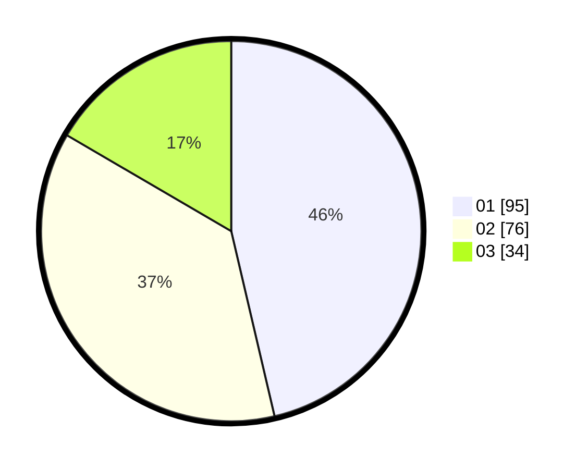

# Hasil

Hasil perolehan suara paslon dapat dilihat pada file paslon-01.txt, paslon-02.txt, dan paslon-03.txt.

Jika tidak ada, artinya data tersebut belum ada pada SIREKAP.

## Perolehan Suara

 * Paslon 01: **95**.
 * Paslon 02: **76**.
 * Paslon 03: **34**.

## Foto C Plano

https://sirekap-obj-formc.kpu.go.id/46e4/pemilu/ppwp/31/71/05/10/02/3171051002120-20240215-034939--e7b62167-d4dc-4941-a512-5666ef13b0ee.jpg

https://sirekap-obj-formc.kpu.go.id/46e4/pemilu/ppwp/31/71/05/10/02/3171051002120-20240215-034945--527b23d7-f110-44de-bf86-7515ed90a3d2.jpg
