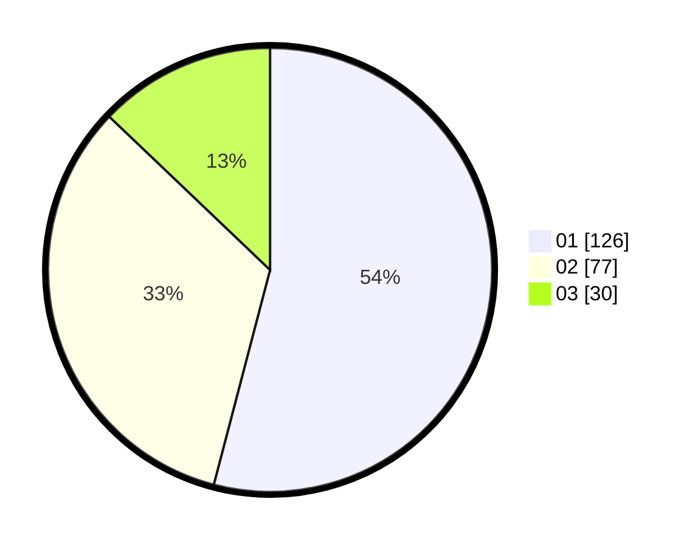

# Hasil

Hasil perolehan suara paslon dapat dilihat pada file paslon-01.txt, paslon-02.txt, dan paslon-03.txt.

Jika tidak ada, artinya data tersebut belum ada pada SIREKAP.

## Perolehan Suara

 * Paslon 01: **126**.
 * Paslon 02: **77**.
 * Paslon 03: **30**.

## Foto C Plano

https://sirekap-obj-formc.kpu.go.id/d73a/pemilu/ppwp/31/71/05/10/03/3171051003004-20240214-194644--f201c5b2-4f41-41dc-b019-fb6b5a7248f3.jpg

https://sirekap-obj-formc.kpu.go.id/d73a/pemilu/ppwp/31/71/05/10/03/3171051003004-20240214-195008--266a5bc9-f4ef-43ed-aa97-6063f21f00b6.jpg

https://sirekap-obj-formc.kpu.go.id/d73a/pemilu/ppwp/31/71/05/10/03/3171051003004-20240214-195104--9be5a37b-8df7-413e-be9a-26061d3b3c79.jpg

## DATA PEMILIH TETAP

Jumlah pemilih dalam DPT: **272**.
 * L: **132**.
 * P: **140**.

## DATA PENGGUNA HAK PILIH

Jumlah pengguna hak pilih dalam DPT: **232**.
 * L: **109**.
 * P: **123**.

Jumlah pengguna hak pilih dalam DPTb: **6**.
 * L: **2**.
 * P: **4**.

Jumlah pengguna hak pilih dalam DPK: **0**.
 * L: **0**.
 * P: **0**.

Jumlah pengguna hak pilih: **238**.
 * L: **111**.
 * P: **127**.

## JUMLAH SUARA SAH DAN TIDAK SAH

JUMLAH SELURUH SUARA SAH: **233**.

JUMLAH SUARA TIDAK SAH: **5**.

JUMLAH SELURUH SUARA SAH DAN SUARA TIDAK SAH: **238**.
