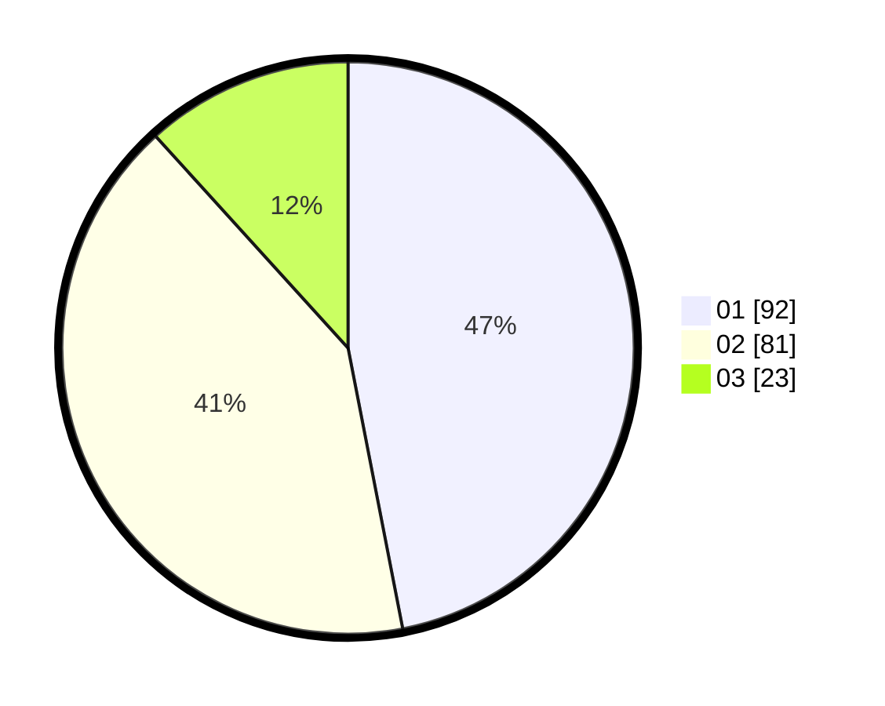

# Hasil

Hasil perolehan suara paslon dapat dilihat pada file paslon-01.txt, paslon-02.txt, dan paslon-03.txt.

Jika tidak ada, artinya data tersebut belum ada pada SIREKAP.

## Perolehan Suara

 * Paslon 01: **92**.
 * Paslon 02: **81**.
 * Paslon 03: **23**.

## Foto C Plano

https://sirekap-obj-formc.kpu.go.id/e501/pemilu/ppwp/31/71/05/10/03/3171051003005-20240215-114610--1a4f8026-c009-4235-a41f-79d20d24578a.jpg

https://sirekap-obj-formc.kpu.go.id/e501/pemilu/ppwp/31/71/05/10/03/3171051003005-20240215-121142--7d7b5a50-ba9f-41dc-98a1-8c02498046ea.jpg

https://sirekap-obj-formc.kpu.go.id/e501/pemilu/ppwp/31/71/05/10/03/3171051003005-20240215-121148--a14e0d57-0119-4964-8c9d-1bf5ce442d6e.jpg

## DATA PEMILIH TETAP

Jumlah pemilih dalam DPT: **266**.
 * L: **133**.
 * P: **133**.

## DATA PENGGUNA HAK PILIH

Jumlah pengguna hak pilih dalam DPT: **200**.
 * L: **94**.
 * P: **106**.

Jumlah pengguna hak pilih dalam DPTb: **1**.
 * L: **1**.
 * P: **0**.

Jumlah pengguna hak pilih dalam DPK: **1**.
 * L: **0**.
 * P: **1**.

Jumlah pengguna hak pilih: **202**.
 * L: **95**.
 * P: **107**.

## JUMLAH SUARA SAH DAN TIDAK SAH

JUMLAH SELURUH SUARA SAH: **196**.

JUMLAH SUARA TIDAK SAH: **6**.

JUMLAH SELURUH SUARA SAH DAN SUARA TIDAK SAH: **202**.
