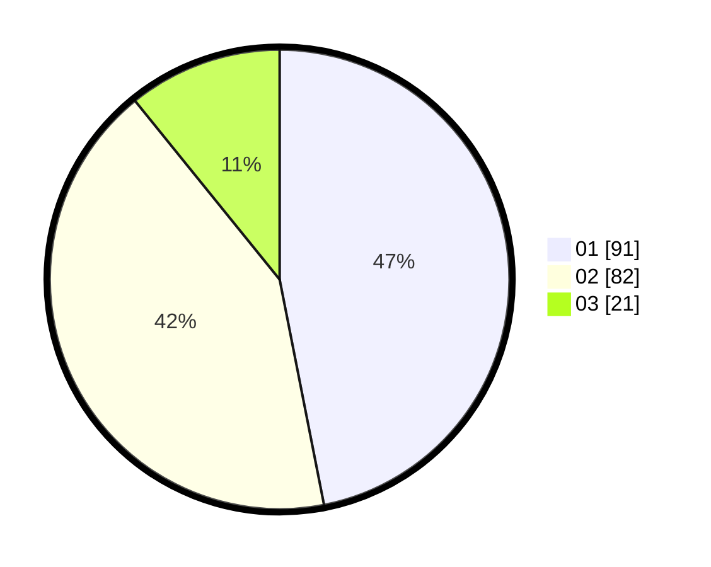

# Hasil

Hasil perolehan suara paslon dapat dilihat pada file paslon-01.txt, paslon-02.txt, dan paslon-03.txt.

Jika tidak ada, artinya data tersebut belum ada pada SIREKAP.

## Perolehan Suara

 * Paslon 01: **91**.
 * Paslon 02: **82**.
 * Paslon 03: **21**.

## Foto C Plano

https://sirekap-obj-formc.kpu.go.id/4cda/pemilu/ppwp/31/71/05/10/03/3171051003006-20240214-190757--37ab0918-bd91-4ebd-97b4-bd870ad468f6.jpg

https://sirekap-obj-formc.kpu.go.id/4cda/pemilu/ppwp/31/71/05/10/03/3171051003006-20240214-190802--bfee07ae-7ee1-4b7a-8546-20015d4c8f6e.jpg

https://sirekap-obj-formc.kpu.go.id/4cda/pemilu/ppwp/31/71/05/10/03/3171051003006-20240214-190807--0a71afe1-baa1-498b-8939-a400011bdad3.jpg

## DATA PEMILIH TETAP

Jumlah pemilih dalam DPT: **260**.
 * L: **132**.
 * P: **128**.

## DATA PENGGUNA HAK PILIH

Jumlah pengguna hak pilih dalam DPT: **184**.
 * L: **95**.
 * P: **89**.

Jumlah pengguna hak pilih dalam DPTb: **10**.
 * L: **6**.
 * P: **4**.

Jumlah pengguna hak pilih dalam DPK: **2**.
 * L: **2**.
 * P: **0**.

Jumlah pengguna hak pilih: **194**.
 * L: **102**.
 * P: **92**.

## JUMLAH SUARA SAH DAN TIDAK SAH

JUMLAH SELURUH SUARA SAH: **194**.

JUMLAH SUARA TIDAK SAH: **2**.

JUMLAH SELURUH SUARA SAH DAN SUARA TIDAK SAH: **196**.
