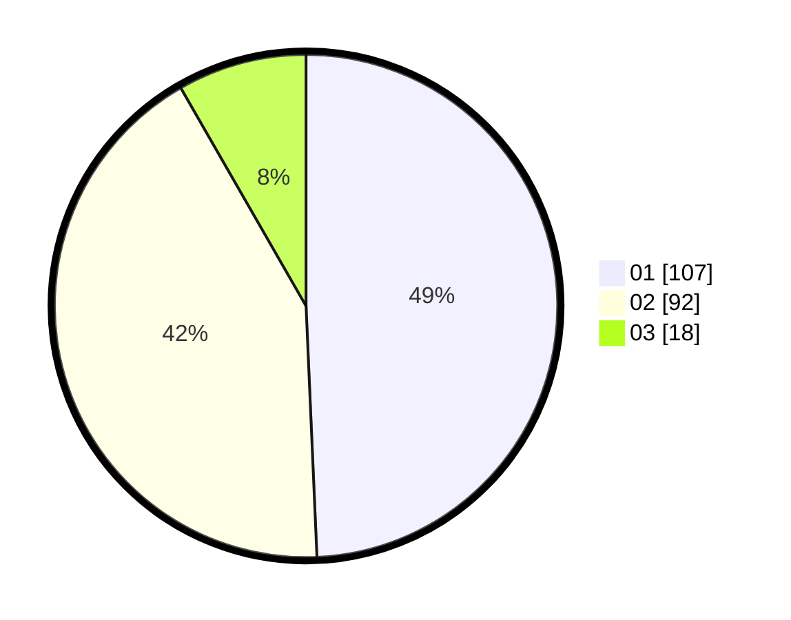

# Hasil

Hasil perolehan suara paslon dapat dilihat pada file paslon-01.txt, paslon-02.txt, dan paslon-03.txt.

Jika tidak ada, artinya data tersebut belum ada pada SIREKAP.

## Perolehan Suara

 * Paslon 01: **107**.
 * Paslon 02: **92**.
 * Paslon 03: **18**.

## Foto C Plano

https://sirekap-obj-formc.kpu.go.id/f79c/pemilu/ppwp/31/71/05/10/03/3171051003008-20240215-000243--0e3c2e73-3afc-4f4c-b956-347f6dc88034.jpg

https://sirekap-obj-formc.kpu.go.id/f79c/pemilu/ppwp/31/71/05/10/03/3171051003008-20240215-000423--4ce9442c-e94b-4c47-94fd-3438729849aa.jpg

https://sirekap-obj-formc.kpu.go.id/f79c/pemilu/ppwp/31/71/05/10/03/3171051003008-20240215-000513--616ba7dc-a770-4e5c-998b-2aa18c81cf9d.jpg

## DATA PEMILIH TETAP

Jumlah pemilih dalam DPT: **254**.
 * L: **126**.
 * P: **128**.

## DATA PENGGUNA HAK PILIH

Jumlah pengguna hak pilih dalam DPT: **135**.
 * L: **109**.
 * P: **26**.

Jumlah pengguna hak pilih dalam DPTb: **13**.
 * L: **6**.
 * P: **7**.

Jumlah pengguna hak pilih dalam DPK: **1**.
 * L: **0**.
 * P: **1**.

Jumlah pengguna hak pilih: **219**.
 * L: **115**.
 * P: **104**.

## JUMLAH SUARA SAH DAN TIDAK SAH

JUMLAH SELURUH SUARA SAH: **217**.

JUMLAH SUARA TIDAK SAH: **1**.

JUMLAH SELURUH SUARA SAH DAN SUARA TIDAK SAH: **218**.
