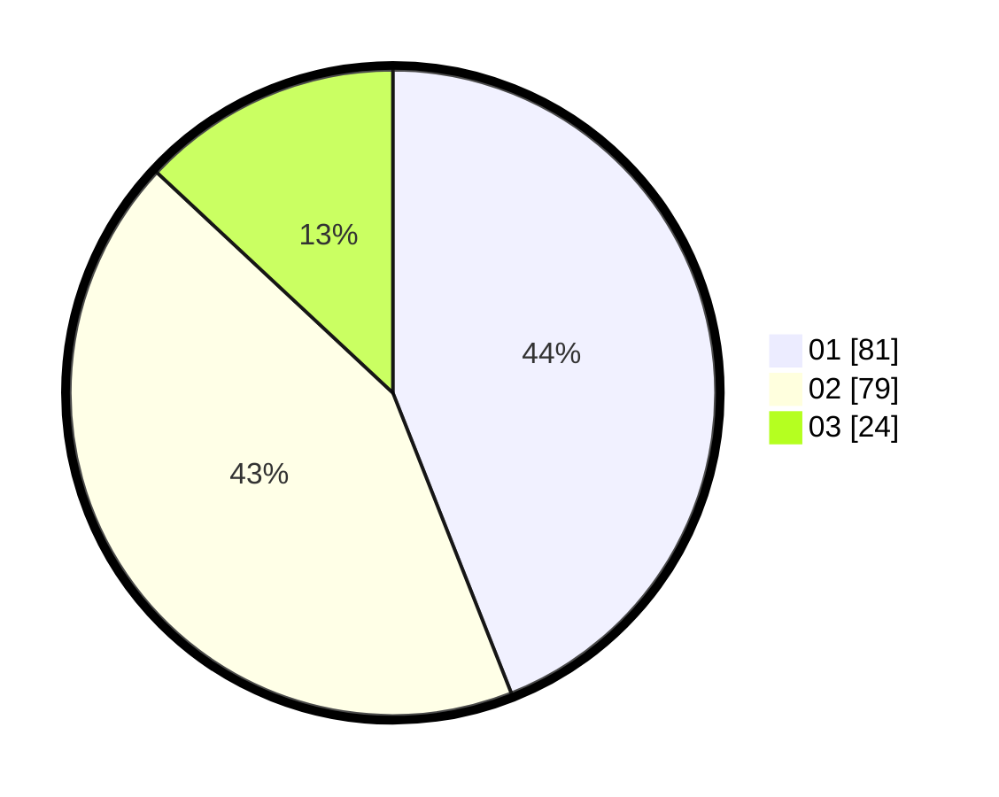

# Hasil

Hasil perolehan suara paslon dapat dilihat pada file paslon-01.txt, paslon-02.txt, dan paslon-03.txt.

Jika tidak ada, artinya data tersebut belum ada pada SIREKAP.

## Perolehan Suara

 * Paslon 01: **81**.
 * Paslon 02: **79**.
 * Paslon 03: **24**.

## Foto C Plano

https://sirekap-obj-formc.kpu.go.id/af6c/pemilu/ppwp/31/71/05/10/03/3171051003009-20240217-000749--498b4715-6b95-4641-a2eb-52d072443b24.jpg

https://sirekap-obj-formc.kpu.go.id/af6c/pemilu/ppwp/31/71/05/10/03/3171051003009-20240217-000751--98fed437-287e-468a-860c-e45cdb83e388.jpg

https://sirekap-obj-formc.kpu.go.id/af6c/pemilu/ppwp/31/71/05/10/03/3171051003009-20240217-000750--392091bd-5dea-4c88-9910-c4da3918c2cb.jpg

## DATA PEMILIH TETAP

Jumlah pemilih dalam DPT: **253**.
 * L: **125**.
 * P: **128**.

## DATA PENGGUNA HAK PILIH

Jumlah pengguna hak pilih dalam DPT: **175**.
 * L: **80**.
 * P: **95**.

Jumlah pengguna hak pilih dalam DPTb: **10**.
 * L: **4**.
 * P: **6**.

Jumlah pengguna hak pilih dalam DPK: **1**.
 * L: **1**.
 * P: **0**.

Jumlah pengguna hak pilih: **186**.
 * L: **85**.
 * P: **101**.

## JUMLAH SUARA SAH DAN TIDAK SAH

JUMLAH SELURUH SUARA SAH: **184**.

JUMLAH SUARA TIDAK SAH: **2**.

JUMLAH SELURUH SUARA SAH DAN SUARA TIDAK SAH: **186**.
