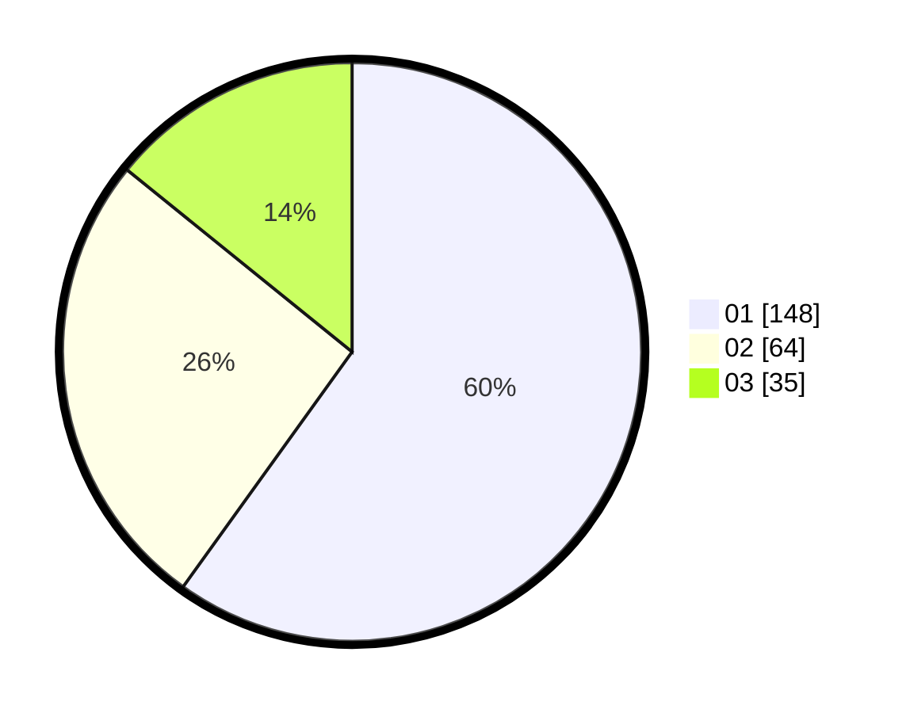

# Hasil

Hasil perolehan suara paslon dapat dilihat pada file paslon-01.txt, paslon-02.txt, dan paslon-03.txt.

Jika tidak ada, artinya data tersebut belum ada pada SIREKAP.

## Perolehan Suara

 * Paslon 01: **148**.
 * Paslon 02: **64**.
 * Paslon 03: **35**.

## Foto C Plano

https://sirekap-obj-formc.kpu.go.id/efda/pemilu/ppwp/31/71/05/10/03/3171051003010-20240214-155149--2e9dfafe-61d7-4ddd-a8ca-231642a6bf08.jpg

https://sirekap-obj-formc.kpu.go.id/efda/pemilu/ppwp/31/71/05/10/03/3171051003010-20240214-193639--056dbd8c-6ad7-4e39-aec6-f2d779bb2a47.jpg

https://sirekap-obj-formc.kpu.go.id/efda/pemilu/ppwp/31/71/05/10/03/3171051003010-20240214-193748--e83ab53b-c947-4f69-bb87-384494c1ca4a.jpg

## DATA PEMILIH TETAP

Jumlah pemilih dalam DPT: **288**.
 * L: **140**.
 * P: **148**.

## DATA PENGGUNA HAK PILIH

Jumlah pengguna hak pilih dalam DPT: **241**.
 * L: **111**.
 * P: **130**.

Jumlah pengguna hak pilih dalam DPTb: **9**.
 * L: **4**.
 * P: **5**.

Jumlah pengguna hak pilih dalam DPK: **0**.
 * L: **0**.
 * P: **0**.

Jumlah pengguna hak pilih: **250**.
 * L: **115**.
 * P: **135**.

## JUMLAH SUARA SAH DAN TIDAK SAH

JUMLAH SELURUH SUARA SAH: **247**.

JUMLAH SUARA TIDAK SAH: **3**.

JUMLAH SELURUH SUARA SAH DAN SUARA TIDAK SAH: **250**.
