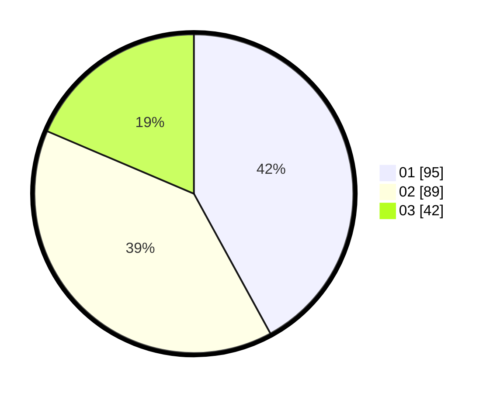

# Hasil

Hasil perolehan suara paslon dapat dilihat pada file paslon-01.txt, paslon-02.txt, dan paslon-03.txt.

Jika tidak ada, artinya data tersebut belum ada pada SIREKAP.

## Perolehan Suara

 * Paslon 01: **95**.
 * Paslon 02: **89**.
 * Paslon 03: **42**.

## Foto C Plano

https://sirekap-obj-formc.kpu.go.id/ae69/pemilu/ppwp/31/71/05/10/03/3171051003011-20240215-001245--154c69a7-7ed0-4cae-9bd5-84b000498bba.jpg

https://sirekap-obj-formc.kpu.go.id/ae69/pemilu/ppwp/31/71/05/10/03/3171051003011-20240215-001325--d68e36c2-eda5-47b2-8603-e4349e747906.jpg

https://sirekap-obj-formc.kpu.go.id/ae69/pemilu/ppwp/31/71/05/10/03/3171051003011-20240215-001445--0b630903-36e2-45a7-86c8-8a4c93d7737e.jpg

## DATA PEMILIH TETAP

Jumlah pemilih dalam DPT: **288**.
 * L: **143**.
 * P: **145**.

## DATA PENGGUNA HAK PILIH

Jumlah pengguna hak pilih dalam DPT: **208**.
 * L: **100**.
 * P: **108**.

Jumlah pengguna hak pilih dalam DPTb: **18**.
 * L: **9**.
 * P: **9**.

Jumlah pengguna hak pilih dalam DPK: **0**.
 * L: **0**.
 * P: **0**.

Jumlah pengguna hak pilih: **226**.
 * L: **109**.
 * P: **117**.

## JUMLAH SUARA SAH DAN TIDAK SAH

JUMLAH SELURUH SUARA SAH: **226**.

JUMLAH SUARA TIDAK SAH: **0**.

JUMLAH SELURUH SUARA SAH DAN SUARA TIDAK SAH: **226**.
