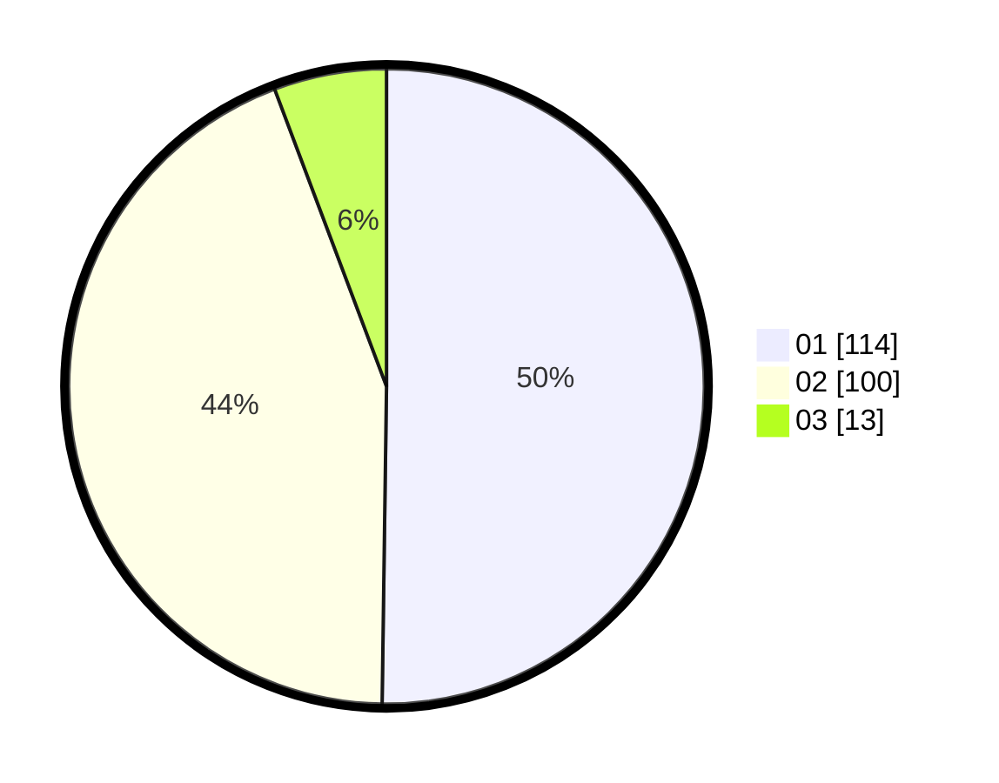

# Hasil

Hasil perolehan suara paslon dapat dilihat pada file paslon-01.txt, paslon-02.txt, dan paslon-03.txt.

Jika tidak ada, artinya data tersebut belum ada pada SIREKAP.

## Perolehan Suara

 * Paslon 01: **114**.
 * Paslon 02: **100**.
 * Paslon 03: **13**.

## Foto C Plano

https://sirekap-obj-formc.kpu.go.id/6031/pemilu/ppwp/31/71/05/10/03/3171051003014-20240216-024720--7327ba3b-b991-4be5-88bf-2212c2671425.jpg

https://sirekap-obj-formc.kpu.go.id/6031/pemilu/ppwp/31/71/05/10/03/3171051003014-20240214-155205--c2024d55-0e7d-4015-890d-fc4abe0ecc73.jpg

https://sirekap-obj-formc.kpu.go.id/6031/pemilu/ppwp/31/71/05/10/03/3171051003014-20240214-155356--f1a86eff-8291-43b8-aec8-992e98e809ba.jpg

## DATA PEMILIH TETAP

Jumlah pemilih dalam DPT: **293**.
 * L: **128**.
 * P: **165**.

## DATA PENGGUNA HAK PILIH

Jumlah pengguna hak pilih dalam DPT: **222**.
 * L: **94**.
 * P: **128**.

Jumlah pengguna hak pilih dalam DPTb: **8**.
 * L: **4**.
 * P: **4**.

Jumlah pengguna hak pilih dalam DPK: **1**.
 * L: **0**.
 * P: **1**.

Jumlah pengguna hak pilih: **231**.
 * L: **98**.
 * P: **133**.

## JUMLAH SUARA SAH DAN TIDAK SAH

JUMLAH SELURUH SUARA SAH: **227**.

JUMLAH SUARA TIDAK SAH: **4**.

JUMLAH SELURUH SUARA SAH DAN SUARA TIDAK SAH: **231**.
