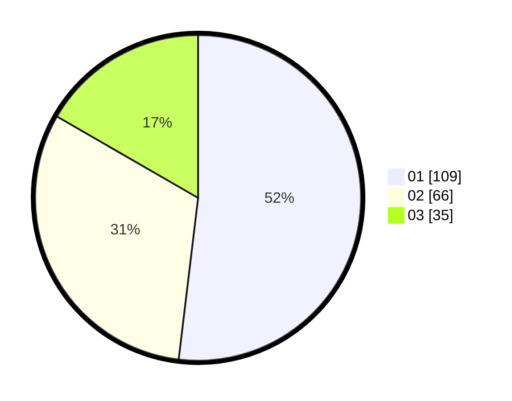

# Hasil

Hasil perolehan suara paslon dapat dilihat pada file paslon-01.txt, paslon-02.txt, dan paslon-03.txt.

Jika tidak ada, artinya data tersebut belum ada pada SIREKAP.

## Perolehan Suara

 * Paslon 01: **109**.
 * Paslon 02: **66**.
 * Paslon 03: **35**.

## Foto C Plano

https://sirekap-obj-formc.kpu.go.id/a03b/pemilu/ppwp/31/71/05/10/03/3171051003015-20240216-032205--32561fd3-9b99-4fce-9c67-94a14265ceec.jpg

https://sirekap-obj-formc.kpu.go.id/a03b/pemilu/ppwp/31/71/05/10/03/3171051003015-20240216-032207--f478aee7-ed7c-4426-9820-1666b79308c2.jpg

https://sirekap-obj-formc.kpu.go.id/a03b/pemilu/ppwp/31/71/05/10/03/3171051003015-20240216-032206--d27b8b3f-d320-4744-9937-6cdd9b8b7d8f.jpg

## DATA PEMILIH TETAP

Jumlah pemilih dalam DPT: **251**.
 * L: **128**.
 * P: **123**.

## DATA PENGGUNA HAK PILIH

Jumlah pengguna hak pilih dalam DPT: **198**.
 * L: **97**.
 * P: **101**.

Jumlah pengguna hak pilih dalam DPTb: **14**.
 * L: **4**.
 * P: **10**.

Jumlah pengguna hak pilih dalam DPK: **1**.
 * L: **0**.
 * P: **1**.

Jumlah pengguna hak pilih: **213**.
 * L: **101**.
 * P: **112**.

## JUMLAH SUARA SAH DAN TIDAK SAH

JUMLAH SELURUH SUARA SAH: **210**.

JUMLAH SUARA TIDAK SAH: **3**.

JUMLAH SELURUH SUARA SAH DAN SUARA TIDAK SAH: **213**.
