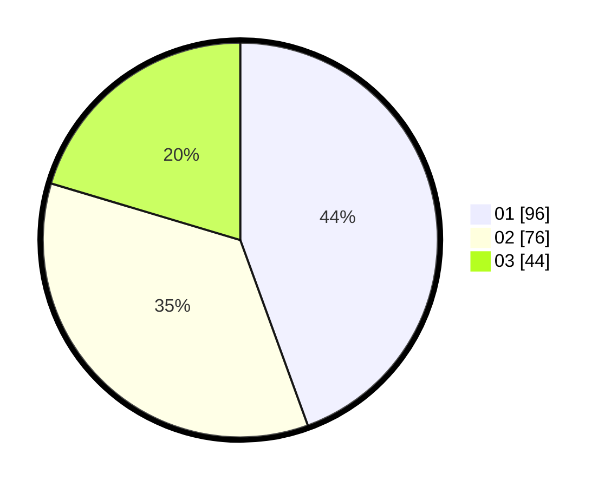

# Hasil

Hasil perolehan suara paslon dapat dilihat pada file paslon-01.txt, paslon-02.txt, dan paslon-03.txt.

Jika tidak ada, artinya data tersebut belum ada pada SIREKAP.

## Perolehan Suara

 * Paslon 01: **96**.
 * Paslon 02: **76**.
 * Paslon 03: **44**.

## Foto C Plano

https://sirekap-obj-formc.kpu.go.id/ad48/pemilu/ppwp/31/71/05/10/03/3171051003016-20240216-044129--8fe2fd12-6c61-453a-ab77-fb555c2ecdd4.jpg

https://sirekap-obj-formc.kpu.go.id/ad48/pemilu/ppwp/31/71/05/10/03/3171051003016-20240216-044131--391bac37-66e6-48e1-afae-071cf299f929.jpg

https://sirekap-obj-formc.kpu.go.id/ad48/pemilu/ppwp/31/71/05/10/03/3171051003016-20240216-044130--79246cf7-16a2-4b53-9ae4-686cf866b145.jpg

## DATA PEMILIH TETAP

Jumlah pemilih dalam DPT: **252**.
 * L: **113**.
 * P: **139**.

## DATA PENGGUNA HAK PILIH

Jumlah pengguna hak pilih dalam DPT: **203**.
 * L: **93**.
 * P: **110**.

Jumlah pengguna hak pilih dalam DPTb: **15**.
 * L: **5**.
 * P: **10**.

Jumlah pengguna hak pilih dalam DPK: **3**.
 * L: **1**.
 * P: **2**.

Jumlah pengguna hak pilih: **221**.
 * L: **99**.
 * P: **122**.

## JUMLAH SUARA SAH DAN TIDAK SAH

JUMLAH SELURUH SUARA SAH: **0**.

JUMLAH SUARA TIDAK SAH: **0**.

JUMLAH SELURUH SUARA SAH DAN SUARA TIDAK SAH: **0**.
