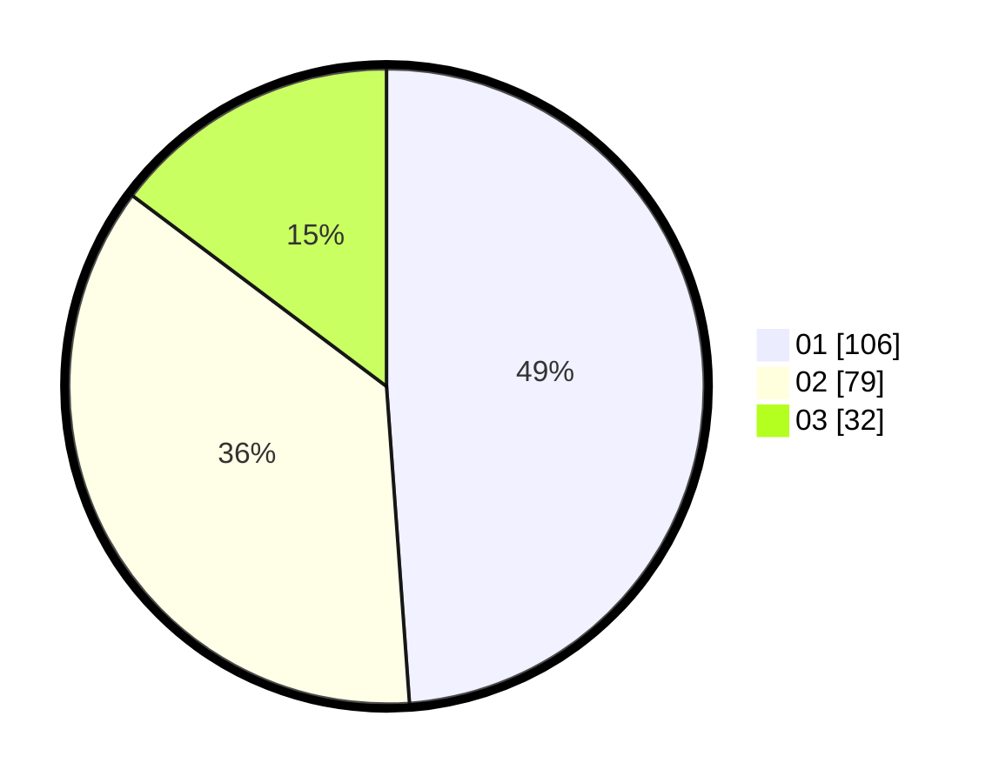

# Hasil

Hasil perolehan suara paslon dapat dilihat pada file paslon-01.txt, paslon-02.txt, dan paslon-03.txt.

Jika tidak ada, artinya data tersebut belum ada pada SIREKAP.

## Perolehan Suara

 * Paslon 01: **106**.
 * Paslon 02: **79**.
 * Paslon 03: **32**.

## Foto C Plano

https://sirekap-obj-formc.kpu.go.id/89a8/pemilu/ppwp/31/71/05/10/03/3171051003017-20240215-034140--4fe06e78-4422-45ca-ae4c-a0f6536c74ab.jpg

https://sirekap-obj-formc.kpu.go.id/89a8/pemilu/ppwp/31/71/05/10/03/3171051003017-20240215-033801--524fc7d7-20ca-4f08-8090-42a1942c69fa.jpg

https://sirekap-obj-formc.kpu.go.id/89a8/pemilu/ppwp/31/71/05/10/03/3171051003017-20240215-035200--7ca994b3-51cf-488b-b3ae-5dbdc25ef385.jpg

## DATA PEMILIH TETAP

Jumlah pemilih dalam DPT: **255**.
 * L: **117**.
 * P: **138**.

## DATA PENGGUNA HAK PILIH

Jumlah pengguna hak pilih dalam DPT: **201**.
 * L: **87**.
 * P: **114**.

Jumlah pengguna hak pilih dalam DPTb: **19**.
 * L: **4**.
 * P: **15**.

Jumlah pengguna hak pilih dalam DPK: **0**.
 * L: **0**.
 * P: **0**.

Jumlah pengguna hak pilih: **220**.
 * L: **91**.
 * P: **129**.

## JUMLAH SUARA SAH DAN TIDAK SAH

JUMLAH SELURUH SUARA SAH: **217**.

JUMLAH SUARA TIDAK SAH: **3**.

JUMLAH SELURUH SUARA SAH DAN SUARA TIDAK SAH: **220**.
