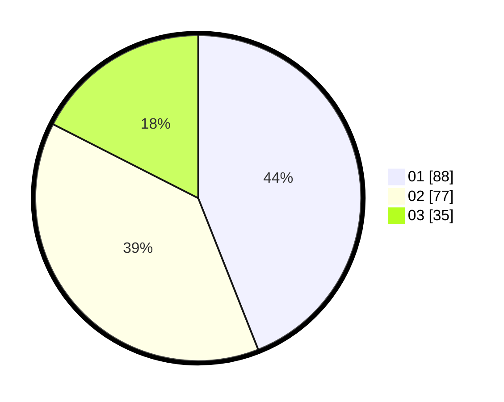

# Hasil

Hasil perolehan suara paslon dapat dilihat pada file paslon-01.txt, paslon-02.txt, dan paslon-03.txt.

Jika tidak ada, artinya data tersebut belum ada pada SIREKAP.

## Perolehan Suara

 * Paslon 01: **88**.
 * Paslon 02: **77**.
 * Paslon 03: **35**.

## Foto C Plano

https://sirekap-obj-formc.kpu.go.id/ea15/pemilu/ppwp/31/71/05/10/03/3171051003019-20240215-220953--cb5c2ae6-8d51-4399-87b3-73132d9aaa0d.jpg

https://sirekap-obj-formc.kpu.go.id/ea15/pemilu/ppwp/31/71/05/10/03/3171051003019-20240215-220955--d313d8ff-a7b1-4bef-812d-47cbabfb266e.jpg

https://sirekap-obj-formc.kpu.go.id/ea15/pemilu/ppwp/31/71/05/10/03/3171051003019-20240215-220954--5e6a7949-eb70-45fc-a9d9-2864d3a07897.jpg

## DATA PEMILIH TETAP

Jumlah pemilih dalam DPT: **201**.
 * L: **87**.
 * P: **114**.

## DATA PENGGUNA HAK PILIH

Jumlah pengguna hak pilih dalam DPT: **201**.
 * L: **87**.
 * P: **114**.

Jumlah pengguna hak pilih dalam DPTb: **0**.
 * L: **0**.
 * P: **0**.

Jumlah pengguna hak pilih dalam DPK: **2**.
 * L: **1**.
 * P: **1**.

Jumlah pengguna hak pilih: **203**.
 * L: **88**.
 * P: **115**.

## JUMLAH SUARA SAH DAN TIDAK SAH

JUMLAH SELURUH SUARA SAH: **200**.

JUMLAH SUARA TIDAK SAH: **3**.

JUMLAH SELURUH SUARA SAH DAN SUARA TIDAK SAH: **203**.
