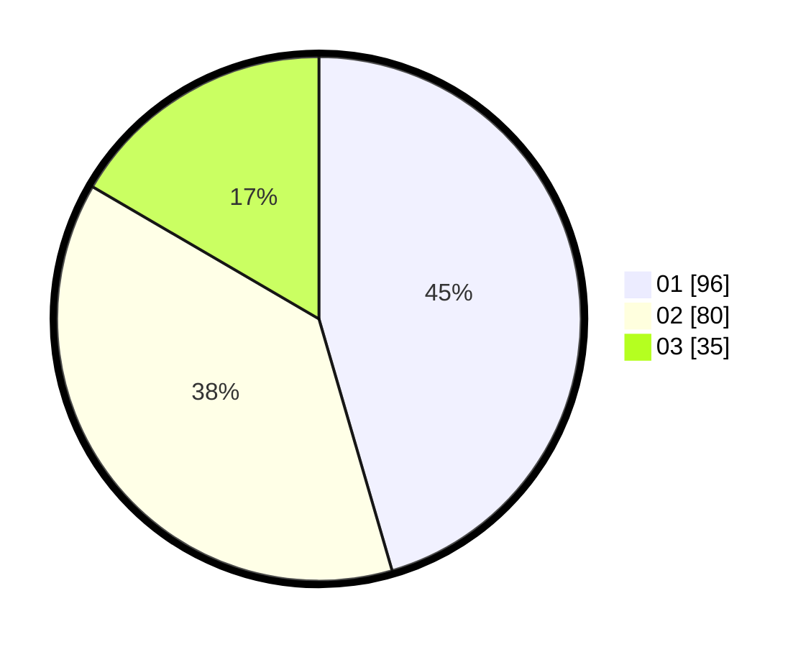

# Hasil

Hasil perolehan suara paslon dapat dilihat pada file paslon-01.txt, paslon-02.txt, dan paslon-03.txt.

Jika tidak ada, artinya data tersebut belum ada pada SIREKAP.

## Perolehan Suara

 * Paslon 01: **96**.
 * Paslon 02: **80**.
 * Paslon 03: **35**.

## Foto C Plano

https://sirekap-obj-formc.kpu.go.id/0a70/pemilu/ppwp/31/71/05/10/03/3171051003020-20240216-040938--64d09820-e88c-4932-ad99-343d89eb2c59.jpg

https://sirekap-obj-formc.kpu.go.id/0a70/pemilu/ppwp/31/71/05/10/03/3171051003020-20240216-040947--5fd043a5-158d-440c-b6c1-8673855580cf.jpg

https://sirekap-obj-formc.kpu.go.id/0a70/pemilu/ppwp/31/71/05/10/03/3171051003020-20240216-040946--ad5002fc-f328-4725-9ac8-5ca9c10a9f54.jpg

## DATA PEMILIH TETAP

Jumlah pemilih dalam DPT: **281**.
 * L: **133**.
 * P: **148**.

## DATA PENGGUNA HAK PILIH

Jumlah pengguna hak pilih dalam DPT: **187**.
 * L: **93**.
 * P: **94**.

Jumlah pengguna hak pilih dalam DPTb: **21**.
 * L: **6**.
 * P: **15**.

Jumlah pengguna hak pilih dalam DPK: **4**.
 * L: **1**.
 * P: **3**.

Jumlah pengguna hak pilih: **212**.
 * L: **100**.
 * P: **112**.

## JUMLAH SUARA SAH DAN TIDAK SAH

JUMLAH SELURUH SUARA SAH: **211**.

JUMLAH SUARA TIDAK SAH: **1**.

JUMLAH SELURUH SUARA SAH DAN SUARA TIDAK SAH: **212**.
