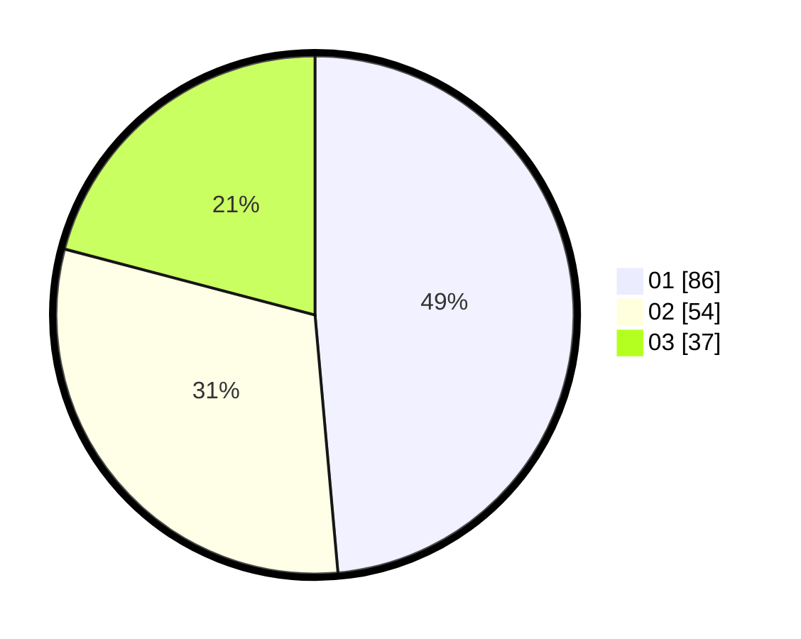

# Hasil

Hasil perolehan suara paslon dapat dilihat pada file paslon-01.txt, paslon-02.txt, dan paslon-03.txt.

Jika tidak ada, artinya data tersebut belum ada pada SIREKAP.

## Perolehan Suara

 * Paslon 01: **86**.
 * Paslon 02: **54**.
 * Paslon 03: **37**.

## Foto C Plano

https://sirekap-obj-formc.kpu.go.id/6fd2/pemilu/ppwp/31/71/05/10/03/3171051003021-20240215-192220--6bcf2bbd-147e-4a24-afaf-547321e6e57e.jpg

https://sirekap-obj-formc.kpu.go.id/6fd2/pemilu/ppwp/31/71/05/10/03/3171051003021-20240215-192249--adeae091-9ea8-4d61-9521-7dd0c2189946.jpg

https://sirekap-obj-formc.kpu.go.id/6fd2/pemilu/ppwp/31/71/05/10/03/3171051003021-20240215-192231--64be5932-6791-4edb-9ce4-a793a08df46a.jpg

## DATA PEMILIH TETAP

Jumlah pemilih dalam DPT: **279**.
 * L: **137**.
 * P: **142**.

## DATA PENGGUNA HAK PILIH

Jumlah pengguna hak pilih dalam DPT: **155**.
 * L: **68**.
 * P: **87**.

Jumlah pengguna hak pilih dalam DPTb: **18**.
 * L: **7**.
 * P: **11**.

Jumlah pengguna hak pilih dalam DPK: **5**.
 * L: **2**.
 * P: **3**.

Jumlah pengguna hak pilih: **178**.
 * L: **77**.
 * P: **101**.

## JUMLAH SUARA SAH DAN TIDAK SAH

JUMLAH SELURUH SUARA SAH: **177**.

JUMLAH SUARA TIDAK SAH: **1**.

JUMLAH SELURUH SUARA SAH DAN SUARA TIDAK SAH: **178**.
