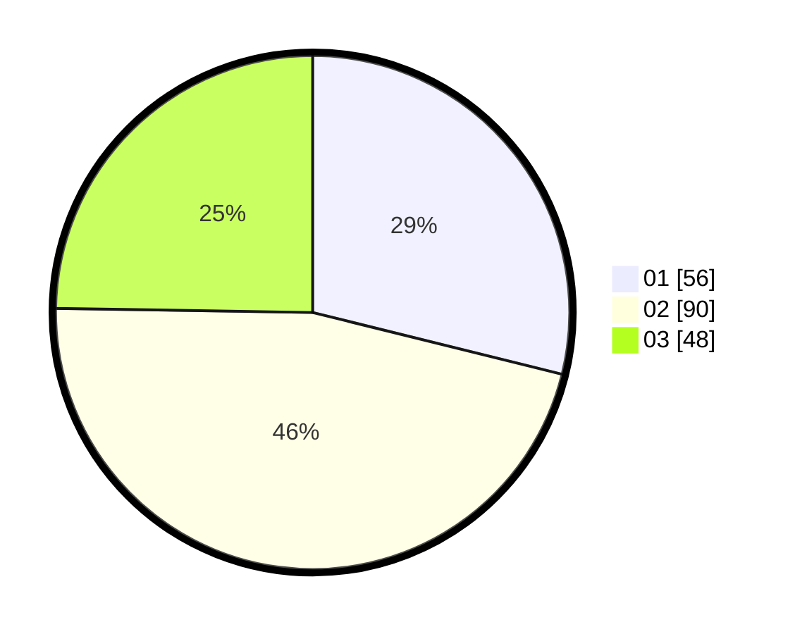

# Hasil

Hasil perolehan suara paslon dapat dilihat pada file paslon-01.txt, paslon-02.txt, dan paslon-03.txt.

Jika tidak ada, artinya data tersebut belum ada pada SIREKAP.

## Perolehan Suara

 * Paslon 01: **56**.
 * Paslon 02: **90**.
 * Paslon 03: **48**.

## Foto C Plano

https://sirekap-obj-formc.kpu.go.id/aa4e/pemilu/ppwp/31/71/05/10/03/3171051003022-20240215-213533--f71f5dec-5060-4e78-8fce-a5df7d611187.jpg

https://sirekap-obj-formc.kpu.go.id/aa4e/pemilu/ppwp/31/71/05/10/03/3171051003022-20240215-213535--2b22d7cc-d0dd-43d4-966e-75660a0dfd37.jpg

https://sirekap-obj-formc.kpu.go.id/aa4e/pemilu/ppwp/31/71/05/10/03/3171051003022-20240215-213534--dc4efeed-4648-4efa-aa37-25f4f958819e.jpg

## DATA PEMILIH TETAP

Jumlah pemilih dalam DPT: **289**.
 * L: **163**.
 * P: **126**.

## DATA PENGGUNA HAK PILIH

Jumlah pengguna hak pilih dalam DPT: **170**.
 * L: **89**.
 * P: **81**.

Jumlah pengguna hak pilih dalam DPTb: **20**.
 * L: **11**.
 * P: **9**.

Jumlah pengguna hak pilih dalam DPK: **6**.
 * L: **2**.
 * P: **4**.

Jumlah pengguna hak pilih: **196**.
 * L: **102**.
 * P: **94**.

## JUMLAH SUARA SAH DAN TIDAK SAH

JUMLAH SELURUH SUARA SAH: **194**.

JUMLAH SUARA TIDAK SAH: **2**.

JUMLAH SELURUH SUARA SAH DAN SUARA TIDAK SAH: **196**.
