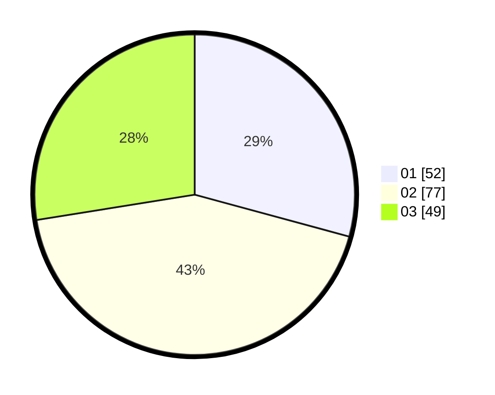

# Hasil

Hasil perolehan suara paslon dapat dilihat pada file paslon-01.txt, paslon-02.txt, dan paslon-03.txt.

Jika tidak ada, artinya data tersebut belum ada pada SIREKAP.

## Perolehan Suara

 * Paslon 01: **52**.
 * Paslon 02: **77**.
 * Paslon 03: **49**.

## Foto C Plano

https://sirekap-obj-formc.kpu.go.id/66bb/pemilu/ppwp/31/71/05/10/03/3171051003029-20240216-133529--09a95f51-489b-49f9-a029-ed47c5d2000c.jpg

https://sirekap-obj-formc.kpu.go.id/66bb/pemilu/ppwp/31/71/05/10/03/3171051003029-20240216-133530--3aa6ae96-4b44-4b52-9c05-e495103d7aa1.jpg

https://sirekap-obj-formc.kpu.go.id/66bb/pemilu/ppwp/31/71/05/10/03/3171051003029-20240214-205654--0fcf4b6e-16d9-4913-b9ad-b19eb4233e7f.jpg

## DATA PEMILIH TETAP

Jumlah pemilih dalam DPT: **280**.
 * L: **130**.
 * P: **150**.

## DATA PENGGUNA HAK PILIH

Jumlah pengguna hak pilih dalam DPT: **166**.
 * L: **73**.
 * P: **93**.

Jumlah pengguna hak pilih dalam DPTb: **12**.
 * L: **4**.
 * P: **8**.

Jumlah pengguna hak pilih dalam DPK: **0**.
 * L: **0**.
 * P: **0**.

Jumlah pengguna hak pilih: **178**.
 * L: **77**.
 * P: **101**.

## JUMLAH SUARA SAH DAN TIDAK SAH

JUMLAH SELURUH SUARA SAH: **178**.

JUMLAH SUARA TIDAK SAH: **0**.

JUMLAH SELURUH SUARA SAH DAN SUARA TIDAK SAH: **178**.
