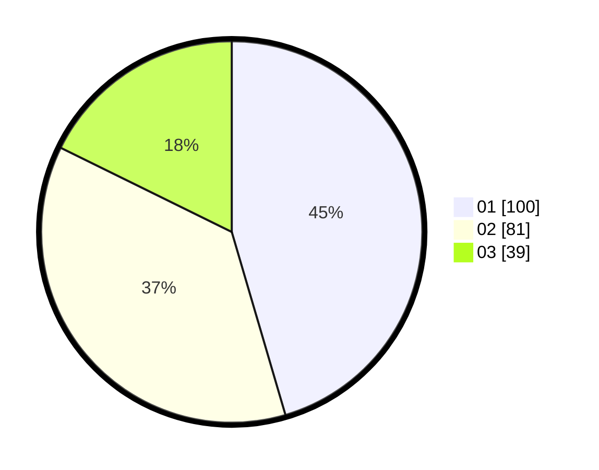

# Hasil

Hasil perolehan suara paslon dapat dilihat pada file paslon-01.txt, paslon-02.txt, dan paslon-03.txt.

Jika tidak ada, artinya data tersebut belum ada pada SIREKAP.

## Perolehan Suara

 * Paslon 01: **100**.
 * Paslon 02: **81**.
 * Paslon 03: **39**.

## Foto C Plano

https://sirekap-obj-formc.kpu.go.id/2232/pemilu/ppwp/31/71/05/10/03/3171051003031-20240216-140408--a0d02277-3f61-4610-b6b5-544e7ae070ea.jpg

https://sirekap-obj-formc.kpu.go.id/2232/pemilu/ppwp/31/71/05/10/03/3171051003031-20240216-140410--8526b78f-a16e-4120-90d6-372194d5c3e4.jpg

https://sirekap-obj-formc.kpu.go.id/2232/pemilu/ppwp/31/71/05/10/03/3171051003031-20240216-140409--b45de52f-7c5a-4aa8-bc98-2bc197f036b9.jpg

## DATA PEMILIH TETAP

Jumlah pemilih dalam DPT: **274**.
 * L: **136**.
 * P: **138**.

## DATA PENGGUNA HAK PILIH

Jumlah pengguna hak pilih dalam DPT: **205**.
 * L: **98**.
 * P: **107**.

Jumlah pengguna hak pilih dalam DPTb: **17**.
 * L: **3**.
 * P: **14**.

Jumlah pengguna hak pilih dalam DPK: **1**.
 * L: **1**.
 * P: **0**.

Jumlah pengguna hak pilih: **223**.
 * L: **102**.
 * P: **121**.

## JUMLAH SUARA SAH DAN TIDAK SAH

JUMLAH SELURUH SUARA SAH: **220**.

JUMLAH SUARA TIDAK SAH: **3**.

JUMLAH SELURUH SUARA SAH DAN SUARA TIDAK SAH: **223**.
