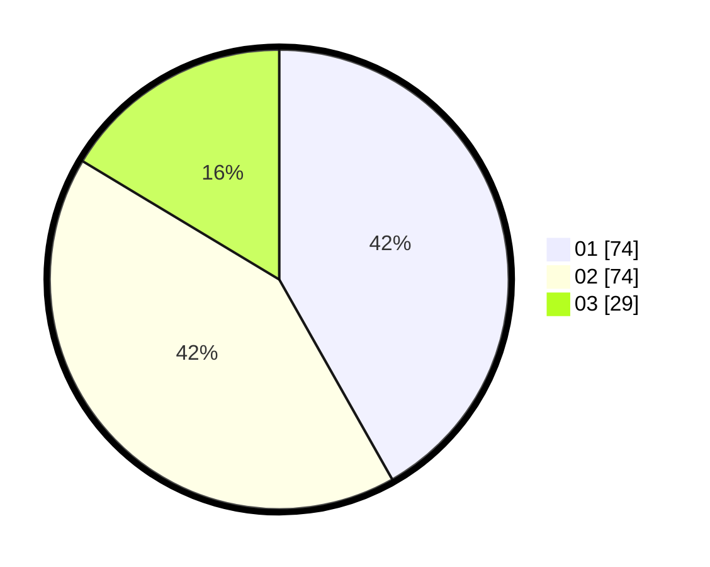

# Hasil

Hasil perolehan suara paslon dapat dilihat pada file paslon-01.txt, paslon-02.txt, dan paslon-03.txt.

Jika tidak ada, artinya data tersebut belum ada pada SIREKAP.

## Perolehan Suara

 * Paslon 01: **74**.
 * Paslon 02: **74**.
 * Paslon 03: **29**.

## Foto C Plano

https://sirekap-obj-formc.kpu.go.id/ed48/pemilu/ppwp/31/71/05/10/03/3171051003035-20240216-070827--301038b0-46de-4be6-907e-e933a8641205.jpg

https://sirekap-obj-formc.kpu.go.id/ed48/pemilu/ppwp/31/71/05/10/03/3171051003035-20240216-070830--824e3c85-f572-453c-a421-a884e694534e.jpg

https://sirekap-obj-formc.kpu.go.id/ed48/pemilu/ppwp/31/71/05/10/03/3171051003035-20240216-070829--4bc098b9-8797-4e0d-a0f6-bb583edce312.jpg

## DATA PEMILIH TETAP

Jumlah pemilih dalam DPT: **278**.
 * L: **139**.
 * P: **139**.

## DATA PENGGUNA HAK PILIH

Jumlah pengguna hak pilih dalam DPT: **167**.
 * L: **80**.
 * P: **87**.

Jumlah pengguna hak pilih dalam DPTb: **10**.
 * L: **5**.
 * P: **5**.

Jumlah pengguna hak pilih dalam DPK: **1**.
 * L: **0**.
 * P: **1**.

Jumlah pengguna hak pilih: **178**.
 * L: **85**.
 * P: **93**.

## JUMLAH SUARA SAH DAN TIDAK SAH

JUMLAH SELURUH SUARA SAH: **177**.

JUMLAH SUARA TIDAK SAH: **1**.

JUMLAH SELURUH SUARA SAH DAN SUARA TIDAK SAH: **178**.
