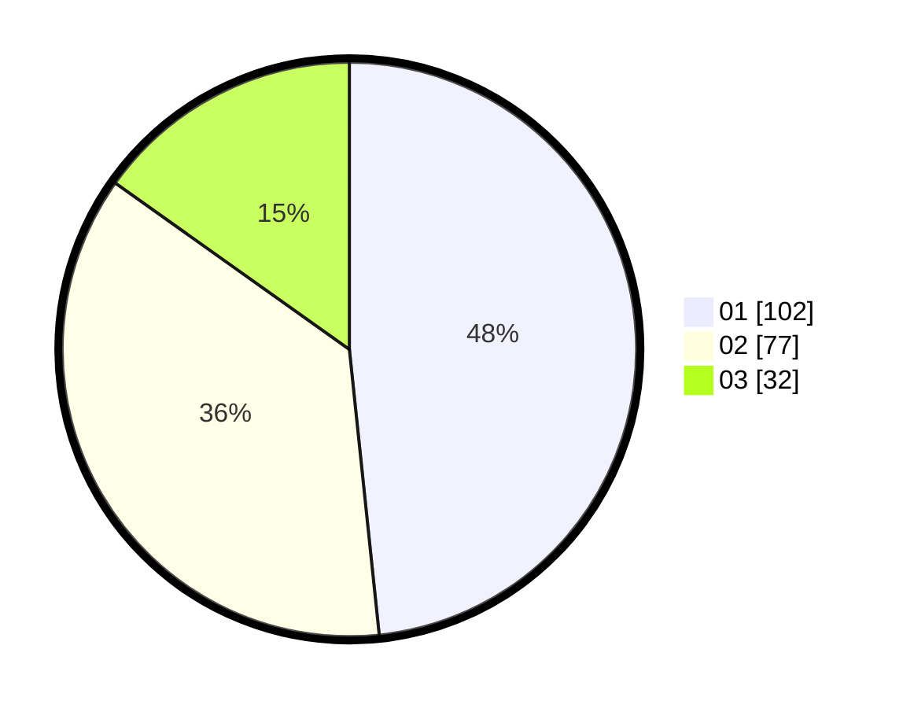

# Hasil

Hasil perolehan suara paslon dapat dilihat pada file paslon-01.txt, paslon-02.txt, dan paslon-03.txt.

Jika tidak ada, artinya data tersebut belum ada pada SIREKAP.

## Perolehan Suara

 * Paslon 01: **102**.
 * Paslon 02: **77**.
 * Paslon 03: **32**.

## Foto C Plano

https://sirekap-obj-formc.kpu.go.id/da13/pemilu/ppwp/31/71/05/10/03/3171051003037-20240214-160055--36cad4c6-28af-4152-8f05-8ab22fce273e.jpg

https://sirekap-obj-formc.kpu.go.id/da13/pemilu/ppwp/31/71/05/10/03/3171051003037-20240214-193439--1dd1e8de-f913-4678-b622-90508c9926d5.jpg

https://sirekap-obj-formc.kpu.go.id/da13/pemilu/ppwp/31/71/05/10/03/3171051003037-20240214-193509--adf8439b-aa64-46b2-9b6d-33189e0fcf47.jpg

## DATA PEMILIH TETAP

Jumlah pemilih dalam DPT: **273**.
 * L: **129**.
 * P: **144**.

## DATA PENGGUNA HAK PILIH

Jumlah pengguna hak pilih dalam DPT: **200**.
 * L: **92**.
 * P: **108**.

Jumlah pengguna hak pilih dalam DPTb: **8**.
 * L: **2**.
 * P: **6**.

Jumlah pengguna hak pilih dalam DPK: **4**.
 * L: **2**.
 * P: **2**.

Jumlah pengguna hak pilih: **212**.
 * L: **96**.
 * P: **116**.

## JUMLAH SUARA SAH DAN TIDAK SAH

JUMLAH SELURUH SUARA SAH: **211**.

JUMLAH SUARA TIDAK SAH: **1**.

JUMLAH SELURUH SUARA SAH DAN SUARA TIDAK SAH: **212**.
