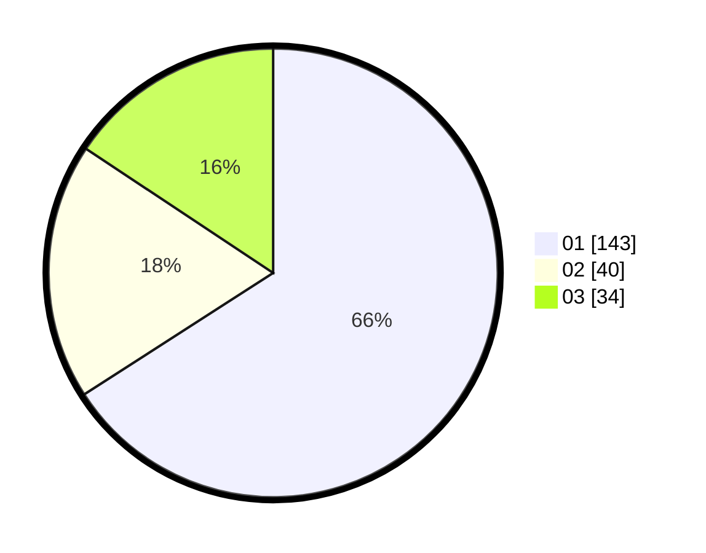

# Hasil

Hasil perolehan suara paslon dapat dilihat pada file paslon-01.txt, paslon-02.txt, dan paslon-03.txt.

Jika tidak ada, artinya data tersebut belum ada pada SIREKAP.

## Perolehan Suara

 * Paslon 01: **143**.
 * Paslon 02: **40**.
 * Paslon 03: **34**.

## Foto C Plano

https://sirekap-obj-formc.kpu.go.id/f61b/pemilu/ppwp/31/71/05/10/03/3171051003039-20240216-040952--8669f310-5546-4395-aafb-b9a6dfc99453.jpg

https://sirekap-obj-formc.kpu.go.id/f61b/pemilu/ppwp/31/71/05/10/03/3171051003039-20240216-035127--2d21b473-6b26-4042-af83-070471e1349a.jpg

https://sirekap-obj-formc.kpu.go.id/f61b/pemilu/ppwp/31/71/05/10/03/3171051003039-20240216-082747--f66f26fa-0e12-4183-ba2b-0962177d1daf.jpg

## DATA PEMILIH TETAP

Jumlah pemilih dalam DPT: **207**.
 * L: **97**.
 * P: **110**.

## DATA PENGGUNA HAK PILIH

Jumlah pengguna hak pilih dalam DPT: **207**.
 * L: **97**.
 * P: **110**.

Jumlah pengguna hak pilih dalam DPTb: **7**.
 * L: **3**.
 * P: **4**.

Jumlah pengguna hak pilih dalam DPK: **4**.
 * L: **2**.
 * P: **2**.

Jumlah pengguna hak pilih: **218**.
 * L: **102**.
 * P: **116**.

## JUMLAH SUARA SAH DAN TIDAK SAH

JUMLAH SELURUH SUARA SAH: **217**.

JUMLAH SUARA TIDAK SAH: **1**.

JUMLAH SELURUH SUARA SAH DAN SUARA TIDAK SAH: **218**.
