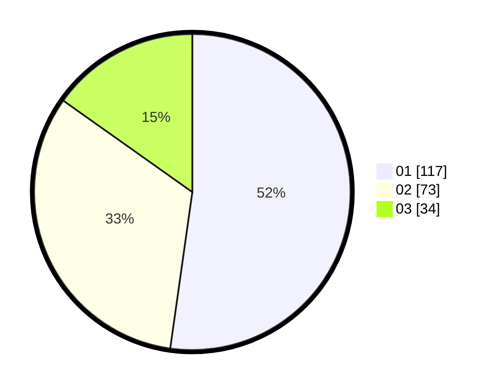

# Hasil

Hasil perolehan suara paslon dapat dilihat pada file paslon-01.txt, paslon-02.txt, dan paslon-03.txt.

Jika tidak ada, artinya data tersebut belum ada pada SIREKAP.

## Perolehan Suara

 * Paslon 01: **117**.
 * Paslon 02: **73**.
 * Paslon 03: **34**.

## Foto C Plano

https://sirekap-obj-formc.kpu.go.id/2494/pemilu/ppwp/31/71/05/10/03/3171051003047-20240215-234725--77f2aa17-f64c-4265-94c6-ad9c55a15ad0.jpg

https://sirekap-obj-formc.kpu.go.id/2494/pemilu/ppwp/31/71/05/10/03/3171051003047-20240215-234726--da82b602-319e-46c0-ae10-e85e39d327c6.jpg

https://sirekap-obj-formc.kpu.go.id/2494/pemilu/ppwp/31/71/05/10/03/3171051003047-20240215-234725--e9474f69-ca06-414d-a9f6-e46cfdf26e76.jpg

## DATA PEMILIH TETAP

Jumlah pemilih dalam DPT: **284**.
 * L: **136**.
 * P: **148**.

## DATA PENGGUNA HAK PILIH

Jumlah pengguna hak pilih dalam DPT: **224**.
 * L: **105**.
 * P: **119**.

Jumlah pengguna hak pilih dalam DPTb: **2**.
 * L: **2**.
 * P: **0**.

Jumlah pengguna hak pilih dalam DPK: **3**.
 * L: **1**.
 * P: **2**.

Jumlah pengguna hak pilih: **229**.
 * L: **108**.
 * P: **121**.

## JUMLAH SUARA SAH DAN TIDAK SAH

JUMLAH SELURUH SUARA SAH: **224**.

JUMLAH SUARA TIDAK SAH: **5**.

JUMLAH SELURUH SUARA SAH DAN SUARA TIDAK SAH: **229**.
