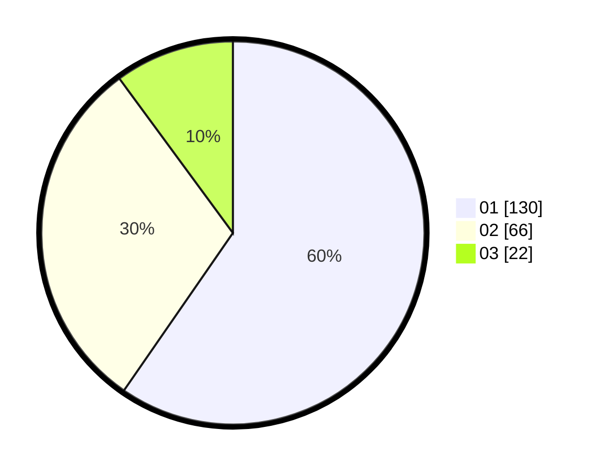

# Hasil

Hasil perolehan suara paslon dapat dilihat pada file paslon-01.txt, paslon-02.txt, dan paslon-03.txt.

Jika tidak ada, artinya data tersebut belum ada pada SIREKAP.

## Perolehan Suara

 * Paslon 01: **130**.
 * Paslon 02: **66**.
 * Paslon 03: **22**.

## Foto C Plano

https://sirekap-obj-formc.kpu.go.id/9370/pemilu/ppwp/31/71/05/10/03/3171051003051-20240214-222955--ba51688b-5a9e-41ec-b4e3-5617f0264867.jpg

https://sirekap-obj-formc.kpu.go.id/9370/pemilu/ppwp/31/71/05/10/03/3171051003051-20240215-103913--9ed5b201-c18a-4137-84af-c74309acac41.jpg

https://sirekap-obj-formc.kpu.go.id/9370/pemilu/ppwp/31/71/05/10/03/3171051003051-20240214-223245--fa2537c0-1f8e-4343-8382-65d3fffe20df.jpg

## DATA PEMILIH TETAP

Jumlah pemilih dalam DPT: **279**.
 * L: **141**.
 * P: **138**.

## DATA PENGGUNA HAK PILIH

Jumlah pengguna hak pilih dalam DPT: **219**.
 * L: **107**.
 * P: **112**.

Jumlah pengguna hak pilih dalam DPTb: **3**.
 * L: **1**.
 * P: **2**.

Jumlah pengguna hak pilih dalam DPK: **6**.
 * L: **3**.
 * P: **3**.

Jumlah pengguna hak pilih: **228**.
 * L: **111**.
 * P: **117**.

## JUMLAH SUARA SAH DAN TIDAK SAH

JUMLAH SELURUH SUARA SAH: **218**.

JUMLAH SUARA TIDAK SAH: **10**.

JUMLAH SELURUH SUARA SAH DAN SUARA TIDAK SAH: **228**.
