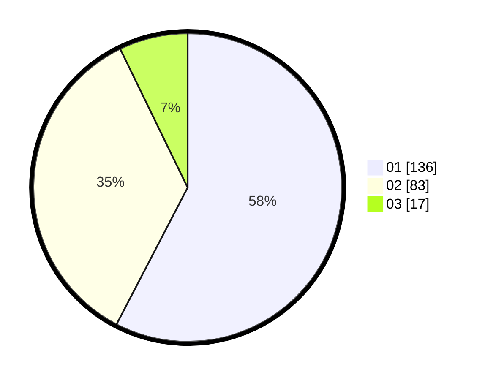

# Hasil

Hasil perolehan suara paslon dapat dilihat pada file paslon-01.txt, paslon-02.txt, dan paslon-03.txt.

Jika tidak ada, artinya data tersebut belum ada pada SIREKAP.

## Perolehan Suara

 * Paslon 01: **136**.
 * Paslon 02: **83**.
 * Paslon 03: **17**.

## Foto C Plano

https://sirekap-obj-formc.kpu.go.id/5823/pemilu/ppwp/31/71/05/10/03/3171051003052-20240215-000652--f601434e-0322-43b5-a6eb-2c4efac1c87d.jpg

https://sirekap-obj-formc.kpu.go.id/5823/pemilu/ppwp/31/71/05/10/03/3171051003052-20240215-000727--b6340857-694c-4152-a4b3-4081a690a27e.jpg

https://sirekap-obj-formc.kpu.go.id/5823/pemilu/ppwp/31/71/05/10/03/3171051003052-20240215-000751--da61e1db-7967-4cf2-8663-7fc0008d7480.jpg

## DATA PEMILIH TETAP

Jumlah pemilih dalam DPT: **287**.
 * L: **140**.
 * P: **147**.

## DATA PENGGUNA HAK PILIH

Jumlah pengguna hak pilih dalam DPT: **233**.
 * L: **110**.
 * P: **123**.

Jumlah pengguna hak pilih dalam DPTb: **2**.
 * L: **1**.
 * P: **1**.

Jumlah pengguna hak pilih dalam DPK: **4**.
 * L: **2**.
 * P: **2**.

Jumlah pengguna hak pilih: **239**.
 * L: **113**.
 * P: **126**.

## JUMLAH SUARA SAH DAN TIDAK SAH

JUMLAH SELURUH SUARA SAH: **236**.

JUMLAH SUARA TIDAK SAH: **3**.

JUMLAH SELURUH SUARA SAH DAN SUARA TIDAK SAH: **239**.
