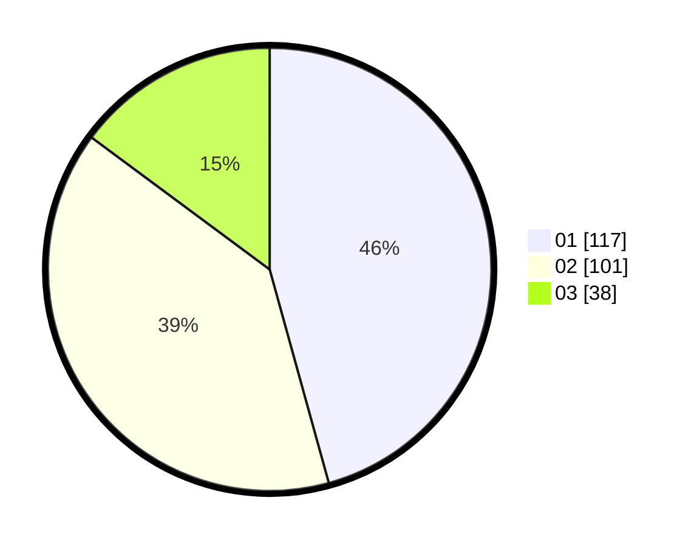

# Hasil

Hasil perolehan suara paslon dapat dilihat pada file paslon-01.txt, paslon-02.txt, dan paslon-03.txt.

Jika tidak ada, artinya data tersebut belum ada pada SIREKAP.

## Perolehan Suara

 * Paslon 01: **117**.
 * Paslon 02: **101**.
 * Paslon 03: **38**.

## Foto C Plano

https://sirekap-obj-formc.kpu.go.id/f070/pemilu/ppwp/31/71/05/10/03/3171051003060-20240215-095543--df8a8238-92d6-4df8-af37-28779e4e467f.jpg

https://sirekap-obj-formc.kpu.go.id/f070/pemilu/ppwp/31/71/05/10/03/3171051003060-20240215-095604--3916d74e-3206-4798-894b-2cc2d0877366.jpg

https://sirekap-obj-formc.kpu.go.id/f070/pemilu/ppwp/31/71/05/10/03/3171051003060-20240215-095553--a456daee-d23c-4f0a-aa21-e38cd61b7762.jpg

## DATA PEMILIH TETAP

Jumlah pemilih dalam DPT: **288**.
 * L: **141**.
 * P: **147**.

## DATA PENGGUNA HAK PILIH

Jumlah pengguna hak pilih dalam DPT: **248**.
 * L: **119**.
 * P: **129**.

Jumlah pengguna hak pilih dalam DPTb: **15**.
 * L: **6**.
 * P: **9**.

Jumlah pengguna hak pilih dalam DPK: **2**.
 * L: **1**.
 * P: **1**.

Jumlah pengguna hak pilih: **265**.
 * L: **126**.
 * P: **139**.

## JUMLAH SUARA SAH DAN TIDAK SAH

JUMLAH SELURUH SUARA SAH: **256**.

JUMLAH SUARA TIDAK SAH: **9**.

JUMLAH SELURUH SUARA SAH DAN SUARA TIDAK SAH: **265**.
