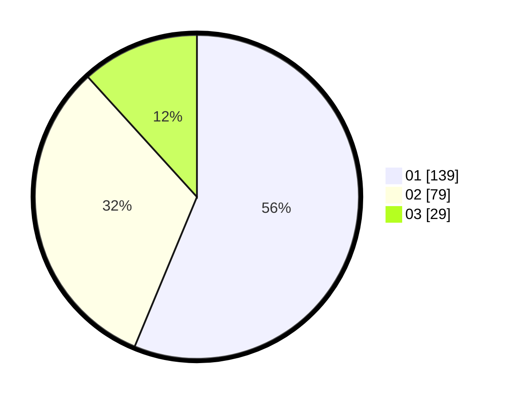

# Hasil

Hasil perolehan suara paslon dapat dilihat pada file paslon-01.txt, paslon-02.txt, dan paslon-03.txt.

Jika tidak ada, artinya data tersebut belum ada pada SIREKAP.

## Perolehan Suara

 * Paslon 01: **139**.
 * Paslon 02: **79**.
 * Paslon 03: **29**.

## Foto C Plano

https://sirekap-obj-formc.kpu.go.id/baf8/pemilu/ppwp/31/71/05/10/03/3171051003061-20240215-220206--489db860-e70b-410b-8741-ec8881d0aaff.jpg

https://sirekap-obj-formc.kpu.go.id/baf8/pemilu/ppwp/31/71/05/10/03/3171051003061-20240215-220207--a877bf34-3e1a-4719-a6e1-6b26fb5629c0.jpg

https://sirekap-obj-formc.kpu.go.id/baf8/pemilu/ppwp/31/71/05/10/03/3171051003061-20240215-220206--ff1890e0-2382-4979-80ea-157cd58a282e.jpg

## DATA PEMILIH TETAP

Jumlah pemilih dalam DPT: **294**.
 * L: **143**.
 * P: **151**.

## DATA PENGGUNA HAK PILIH

Jumlah pengguna hak pilih dalam DPT: **222**.
 * L: **104**.
 * P: **118**.

Jumlah pengguna hak pilih dalam DPTb: **25**.
 * L: **7**.
 * P: **18**.

Jumlah pengguna hak pilih dalam DPK: **0**.
 * L: **0**.
 * P: **0**.

Jumlah pengguna hak pilih: **247**.
 * L: **111**.
 * P: **136**.

## JUMLAH SUARA SAH DAN TIDAK SAH

JUMLAH SELURUH SUARA SAH: **247**.

JUMLAH SUARA TIDAK SAH: **0**.

JUMLAH SELURUH SUARA SAH DAN SUARA TIDAK SAH: **247**.
