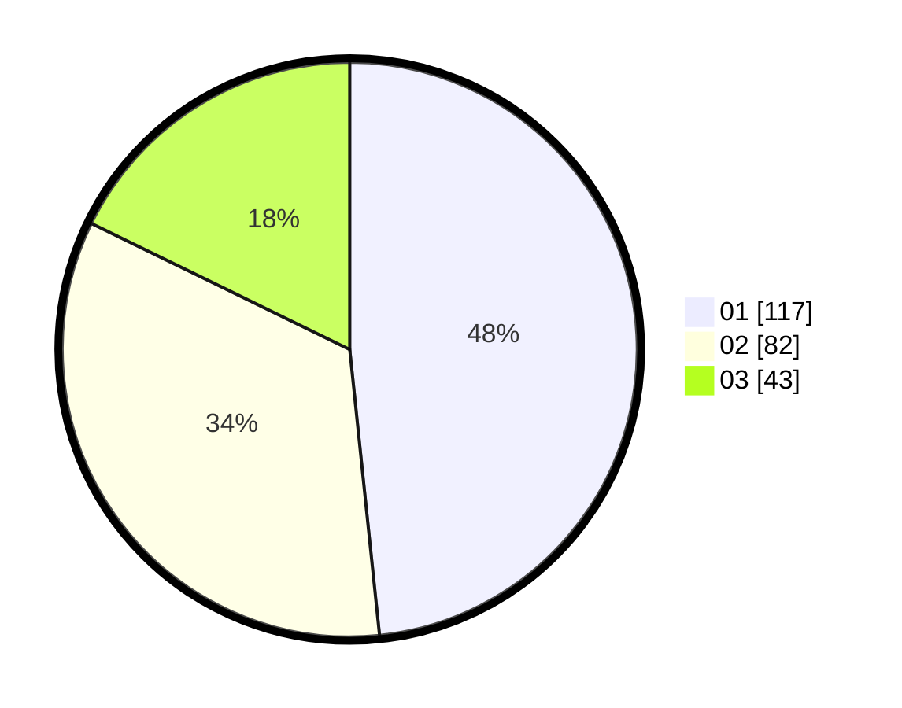

# Hasil

Hasil perolehan suara paslon dapat dilihat pada file paslon-01.txt, paslon-02.txt, dan paslon-03.txt.

Jika tidak ada, artinya data tersebut belum ada pada SIREKAP.

## Perolehan Suara

 * Paslon 01: **117**.
 * Paslon 02: **82**.
 * Paslon 03: **43**.

## Foto C Plano

https://sirekap-obj-formc.kpu.go.id/137b/pemilu/ppwp/31/71/05/10/03/3171051003063-20240214-233620--622e7e93-56f6-4adf-9e4c-077043937ba8.jpg

https://sirekap-obj-formc.kpu.go.id/137b/pemilu/ppwp/31/71/05/10/03/3171051003063-20240215-003039--932d9033-66f1-431c-846f-f416c935a6f6.jpg

https://sirekap-obj-formc.kpu.go.id/137b/pemilu/ppwp/31/71/05/10/03/3171051003063-20240215-003213--a449dd71-e35a-4668-9db6-216b6990d646.jpg

## DATA PEMILIH TETAP

Jumlah pemilih dalam DPT: **244**.
 * L: **124**.
 * P: **120**.

## DATA PENGGUNA HAK PILIH

Jumlah pengguna hak pilih dalam DPT: **232**.
 * L: **118**.
 * P: **114**.

Jumlah pengguna hak pilih dalam DPTb: **12**.
 * L: **6**.
 * P: **6**.

Jumlah pengguna hak pilih dalam DPK: **0**.
 * L: **0**.
 * P: **0**.

Jumlah pengguna hak pilih: **244**.
 * L: **124**.
 * P: **120**.

## JUMLAH SUARA SAH DAN TIDAK SAH

JUMLAH SELURUH SUARA SAH: **242**.

JUMLAH SUARA TIDAK SAH: **2**.

JUMLAH SELURUH SUARA SAH DAN SUARA TIDAK SAH: **244**.
