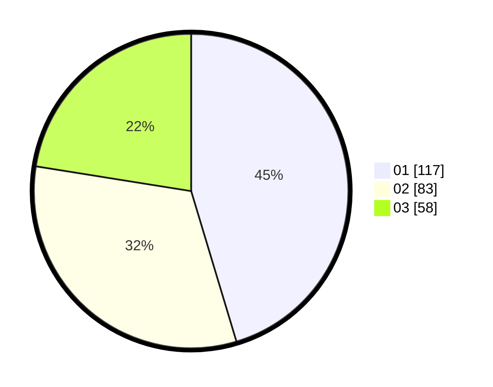

# Hasil

Hasil perolehan suara paslon dapat dilihat pada file paslon-01.txt, paslon-02.txt, dan paslon-03.txt.

Jika tidak ada, artinya data tersebut belum ada pada SIREKAP.

## Perolehan Suara

 * Paslon 01: **117**.
 * Paslon 02: **83**.
 * Paslon 03: **58**.

## Foto C Plano

https://sirekap-obj-formc.kpu.go.id/79f3/pemilu/ppwp/31/71/05/10/03/3171051003066-20240214-195958--d5b4183f-6553-4669-81e9-3741a1d4618a.jpg

https://sirekap-obj-formc.kpu.go.id/79f3/pemilu/ppwp/31/71/05/10/03/3171051003066-20240214-194006--7d1665e4-1099-4fc4-b98e-1942498c64cd.jpg

https://sirekap-obj-formc.kpu.go.id/79f3/pemilu/ppwp/31/71/05/10/03/3171051003066-20240215-230825--18049838-c558-4e7b-bc11-69b095501b73.jpg

## DATA PEMILIH TETAP

Jumlah pemilih dalam DPT: **292**.
 * L: **141**.
 * P: **151**.

## DATA PENGGUNA HAK PILIH

Jumlah pengguna hak pilih dalam DPT: **230**.
 * L: **105**.
 * P: **125**.

Jumlah pengguna hak pilih dalam DPTb: **33**.
 * L: **15**.
 * P: **18**.

Jumlah pengguna hak pilih dalam DPK: **1**.
 * L: **1**.
 * P: **0**.

Jumlah pengguna hak pilih: **264**.
 * L: **121**.
 * P: **143**.

## JUMLAH SUARA SAH DAN TIDAK SAH

JUMLAH SELURUH SUARA SAH: **258**.

JUMLAH SUARA TIDAK SAH: **6**.

JUMLAH SELURUH SUARA SAH DAN SUARA TIDAK SAH: **264**.
