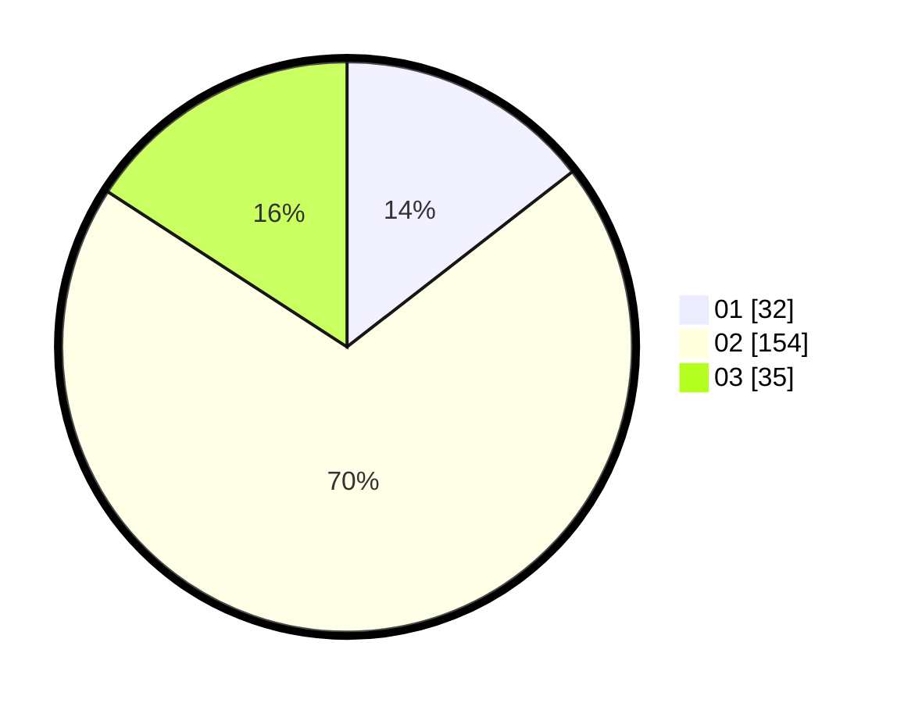

# Hasil

Hasil perolehan suara paslon dapat dilihat pada file paslon-01.txt, paslon-02.txt, dan paslon-03.txt.

Jika tidak ada, artinya data tersebut belum ada pada SIREKAP.

## Perolehan Suara

 * Paslon 01: **32**.
 * Paslon 02: **154**.
 * Paslon 03: **35**.

## Foto C Plano

https://sirekap-obj-formc.kpu.go.id/804d/pemilu/ppwp/31/71/05/10/03/3171051003905-20240216-010739--a1c8f97e-6d65-471b-9eb9-0b8f4898a9c6.jpg

https://sirekap-obj-formc.kpu.go.id/804d/pemilu/ppwp/31/71/05/10/03/3171051003905-20240216-010744--a20c2ebd-9ba9-4a59-bef3-efcb6cd5d4f2.jpg

https://sirekap-obj-formc.kpu.go.id/804d/pemilu/ppwp/31/71/05/10/03/3171051003905-20240216-010741--5db10c16-457d-4fc3-a840-b6e3ca50a87d.jpg

## DATA PEMILIH TETAP

Jumlah pemilih dalam DPT: **272**.
 * L: **271**.
 * P: **1**.

## DATA PENGGUNA HAK PILIH

Jumlah pengguna hak pilih dalam DPT: **100**.
 * L: **99**.
 * P: **1**.

Jumlah pengguna hak pilih dalam DPTb: **127**.
 * L: **126**.
 * P: **1**.

Jumlah pengguna hak pilih dalam DPK: **0**.
 * L: **0**.
 * P: **0**.

Jumlah pengguna hak pilih: **227**.
 * L: **225**.
 * P: **2**.

## JUMLAH SUARA SAH DAN TIDAK SAH

JUMLAH SELURUH SUARA SAH: **221**.

JUMLAH SUARA TIDAK SAH: **6**.

JUMLAH SELURUH SUARA SAH DAN SUARA TIDAK SAH: **227**.
