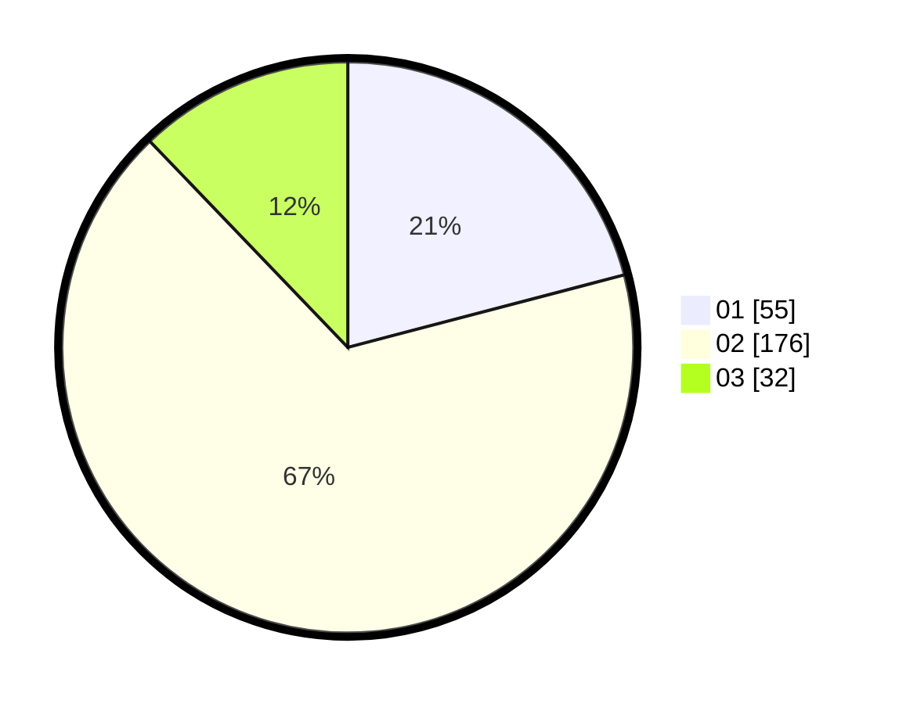

# Hasil

Hasil perolehan suara paslon dapat dilihat pada file paslon-01.txt, paslon-02.txt, dan paslon-03.txt.

Jika tidak ada, artinya data tersebut belum ada pada SIREKAP.

## Perolehan Suara

 * Paslon 01: **55**.
 * Paslon 02: **176**.
 * Paslon 03: **32**.

## Foto C Plano

https://sirekap-obj-formc.kpu.go.id/99fa/pemilu/ppwp/31/71/05/10/03/3171051003906-20240216-003702--91edf71a-4281-49af-82a4-26e41a01b7ae.jpg

https://sirekap-obj-formc.kpu.go.id/99fa/pemilu/ppwp/31/71/05/10/03/3171051003906-20240216-003713--7721e873-c0d0-45a2-8f42-35bfea559e2f.jpg

https://sirekap-obj-formc.kpu.go.id/99fa/pemilu/ppwp/31/71/05/10/03/3171051003906-20240216-003706--3ce0721f-9c79-4755-ad7d-ba679ea16e2a.jpg

## DATA PEMILIH TETAP

Jumlah pemilih dalam DPT: **272**.
 * L: **272**.
 * P: **0**.

## DATA PENGGUNA HAK PILIH

Jumlah pengguna hak pilih dalam DPT: **137**.
 * L: **137**.
 * P: **0**.

Jumlah pengguna hak pilih dalam DPTb: **130**.
 * L: **124**.
 * P: **6**.

Jumlah pengguna hak pilih dalam DPK: **0**.
 * L: **0**.
 * P: **0**.

Jumlah pengguna hak pilih: **267**.
 * L: **261**.
 * P: **6**.

## JUMLAH SUARA SAH DAN TIDAK SAH

JUMLAH SELURUH SUARA SAH: **263**.

JUMLAH SUARA TIDAK SAH: **4**.

JUMLAH SELURUH SUARA SAH DAN SUARA TIDAK SAH: **267**.
