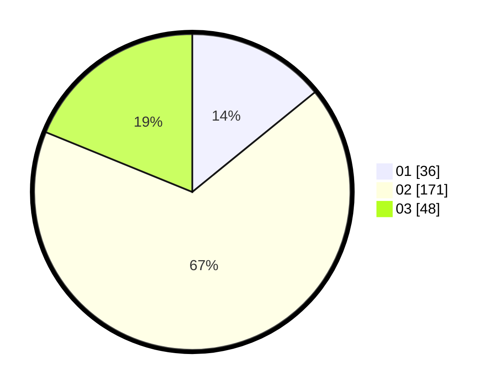

# Hasil

Hasil perolehan suara paslon dapat dilihat pada file paslon-01.txt, paslon-02.txt, dan paslon-03.txt.

Jika tidak ada, artinya data tersebut belum ada pada SIREKAP.

## Perolehan Suara

 * Paslon 01: **36**.
 * Paslon 02: **171**.
 * Paslon 03: **48**.

## Foto C Plano

https://sirekap-obj-formc.kpu.go.id/19f8/pemilu/ppwp/31/71/05/10/03/3171051003907-20240216-093234--52310518-1f40-483c-a592-a199d9fd08a2.jpg

https://sirekap-obj-formc.kpu.go.id/19f8/pemilu/ppwp/31/71/05/10/03/3171051003907-20240216-093245--d7699438-7f74-4993-a8e1-bc6721e2eeff.jpg

https://sirekap-obj-formc.kpu.go.id/19f8/pemilu/ppwp/31/71/05/10/03/3171051003907-20240216-092828--9ffc3120-d593-42cc-948e-4cab0f5cdaa5.jpg

## DATA PEMILIH TETAP

Jumlah pemilih dalam DPT: **274**.
 * L: **274**.
 * P: **0**.

## DATA PENGGUNA HAK PILIH

Jumlah pengguna hak pilih dalam DPT: **125**.
 * L: **125**.
 * P: **0**.

Jumlah pengguna hak pilih dalam DPTb: **135**.
 * L: **132**.
 * P: **3**.

Jumlah pengguna hak pilih dalam DPK: **0**.
 * L: **0**.
 * P: **0**.

Jumlah pengguna hak pilih: **260**.
 * L: **257**.
 * P: **3**.

## JUMLAH SUARA SAH DAN TIDAK SAH

JUMLAH SELURUH SUARA SAH: **255**.

JUMLAH SUARA TIDAK SAH: **5**.

JUMLAH SELURUH SUARA SAH DAN SUARA TIDAK SAH: **260**.
