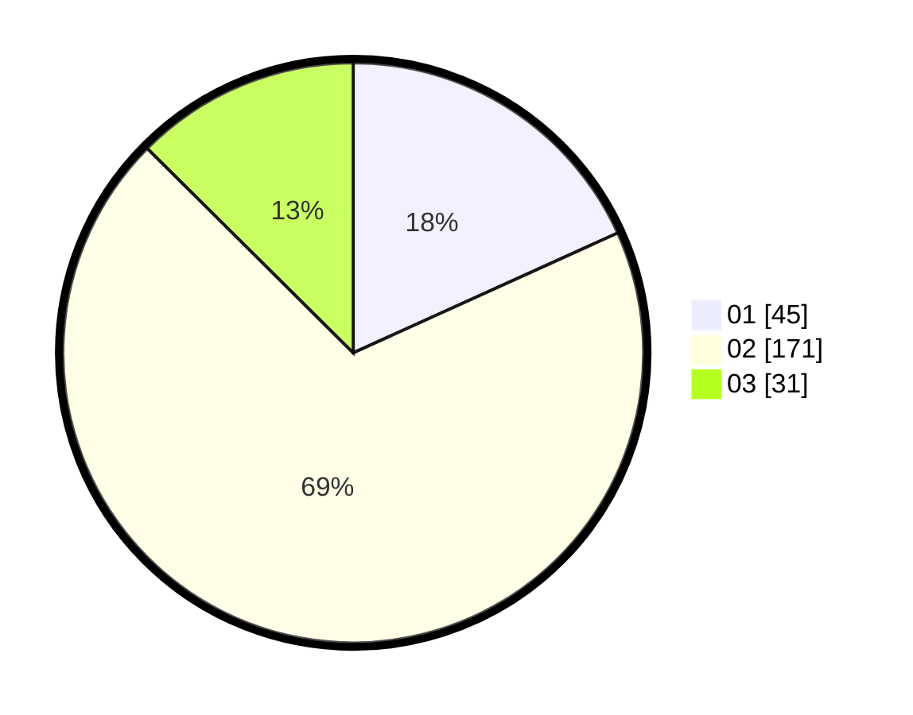

# Hasil

Hasil perolehan suara paslon dapat dilihat pada file paslon-01.txt, paslon-02.txt, dan paslon-03.txt.

Jika tidak ada, artinya data tersebut belum ada pada SIREKAP.

## Perolehan Suara

 * Paslon 01: **45**.
 * Paslon 02: **171**.
 * Paslon 03: **31**.

## Foto C Plano

https://sirekap-obj-formc.kpu.go.id/0cce/pemilu/ppwp/31/71/05/10/03/3171051003908-20240214-191840--1856e27e-fa00-4593-8c15-3c6aca4aae68.jpg

https://sirekap-obj-formc.kpu.go.id/0cce/pemilu/ppwp/31/71/05/10/03/3171051003908-20240214-191847--e8adbcc0-aa2d-4dfd-8d06-f219a0178049.jpg

https://sirekap-obj-formc.kpu.go.id/0cce/pemilu/ppwp/31/71/05/10/03/3171051003908-20240214-191855--b7093b42-d4a5-456e-afe6-9c20a0ae4de1.jpg
