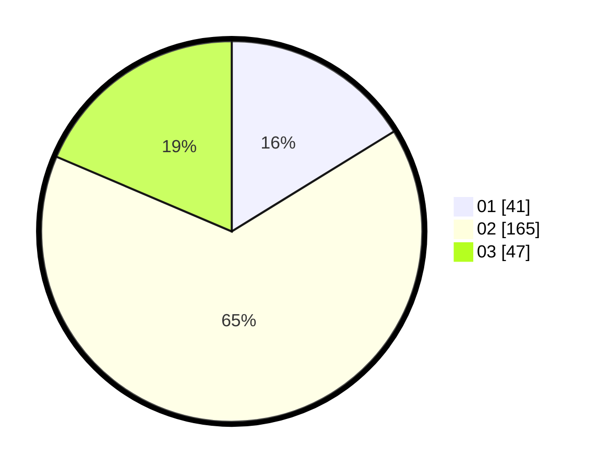

# Hasil

Hasil perolehan suara paslon dapat dilihat pada file paslon-01.txt, paslon-02.txt, dan paslon-03.txt.

Jika tidak ada, artinya data tersebut belum ada pada SIREKAP.

## Perolehan Suara

 * Paslon 01: **41**.
 * Paslon 02: **165**.
 * Paslon 03: **47**.

## Foto C Plano

https://sirekap-obj-formc.kpu.go.id/8545/pemilu/ppwp/31/71/05/10/03/3171051003911-20240216-150824--d4fe88e1-6255-4ae0-8a56-a9f44d7954cd.jpg

https://sirekap-obj-formc.kpu.go.id/8545/pemilu/ppwp/31/71/05/10/03/3171051003911-20240216-150826--76f8dbd2-b5fd-4bf4-9aac-40ff3a6103a4.jpg

https://sirekap-obj-formc.kpu.go.id/8545/pemilu/ppwp/31/71/05/10/03/3171051003911-20240216-150825--9f9330db-9803-4490-941e-394deb253415.jpg

## DATA PEMILIH TETAP

Jumlah pemilih dalam DPT: **246**.
 * L: **244**.
 * P: **2**.

## DATA PENGGUNA HAK PILIH

Jumlah pengguna hak pilih dalam DPT: **92**.
 * L: **90**.
 * P: **2**.

Jumlah pengguna hak pilih dalam DPTb: **168**.
 * L: **166**.
 * P: **2**.

Jumlah pengguna hak pilih dalam DPK: **0**.
 * L: **0**.
 * P: **0**.

Jumlah pengguna hak pilih: **260**.
 * L: **256**.
 * P: **4**.

## JUMLAH SUARA SAH DAN TIDAK SAH

JUMLAH SELURUH SUARA SAH: **253**.

JUMLAH SUARA TIDAK SAH: **7**.

JUMLAH SELURUH SUARA SAH DAN SUARA TIDAK SAH: **260**.
