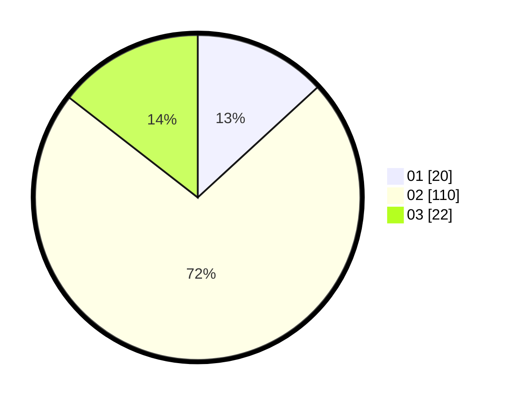

# Hasil

Hasil perolehan suara paslon dapat dilihat pada file paslon-01.txt, paslon-02.txt, dan paslon-03.txt.

Jika tidak ada, artinya data tersebut belum ada pada SIREKAP.

## Perolehan Suara

 * Paslon 01: **20**.
 * Paslon 02: **110**.
 * Paslon 03: **22**.

## Foto C Plano

https://sirekap-obj-formc.kpu.go.id/d79c/pemilu/ppwp/31/71/05/10/03/3171051003912-20240216-055219--59d368f1-fa2e-4a41-b75f-8f59a2a937c6.jpg

https://sirekap-obj-formc.kpu.go.id/d79c/pemilu/ppwp/31/71/05/10/03/3171051003912-20240216-055221--7fe9d648-4c88-4888-8967-85c95b24c277.jpg

https://sirekap-obj-formc.kpu.go.id/d79c/pemilu/ppwp/31/71/05/10/03/3171051003912-20240216-055220--0f619471-ab71-4d41-bad9-d7517ee96e5d.jpg

## DATA PEMILIH TETAP

Jumlah pemilih dalam DPT: **252**.
 * L: **251**.
 * P: **1**.

## DATA PENGGUNA HAK PILIH

Jumlah pengguna hak pilih dalam DPT: **104**.
 * L: **103**.
 * P: **1**.

Jumlah pengguna hak pilih dalam DPTb: **50**.
 * L: **48**.
 * P: **2**.

Jumlah pengguna hak pilih dalam DPK: **0**.
 * L: **0**.
 * P: **0**.

Jumlah pengguna hak pilih: **154**.
 * L: **151**.
 * P: **3**.

## JUMLAH SUARA SAH DAN TIDAK SAH

JUMLAH SELURUH SUARA SAH: **152**.

JUMLAH SUARA TIDAK SAH: **2**.

JUMLAH SELURUH SUARA SAH DAN SUARA TIDAK SAH: **154**.
